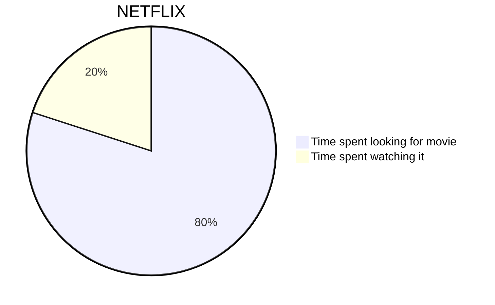

# What is Salesforce Integration?

Salesforce Integration is the process of bringing two or more systems together, which allows you to streamline separate processes.



Think of cases in your own technology stack in which information is kept in one system but also required in another. By integrating them, you can easily manage all that information through multiple business processes that run across multiple systems.

## Why Integration is Important ?

We live in a digital era and we constantly need to improve our efficiency and our customers’ experience to remain competitive – it’s rare that a system works in isolation now. We need to become better and better at integrating our systems so that we can do it faster and in a salable manner.

## What is an API?

API stands for Application Programming Interface. It is the means that allows two applications to talk to each other.

For example, when you use an app on your phone, the app connects to the internet, grabs data from a server, and presents it back to you in a readable format. With the right API, this whole process should happen without a hitch.

There are different types of APIs which I will cover later in the ‘Salesforce Integration Capabilities’ section.

# Types of Salesforce Integration Architectures

Each type of integration architecture offers both benefits and drawbacks worth noting. I will take you through the following three types:

- Point-to-point integration
- Hub - Spoke integration
- Enterprise Service Bus Integration (ESB)

### Point to Point Integration

Also known as one-to-one integration, a point-to-point system integration sends a message to another system via a 1-1 relationship.

```
   Salesforce ───────────────► External System
(Direct Callout)              (API Endpoint)
```

- A **direct connection** between **Salesforce** and **one external system**.
- No middle-ware (like MuleSoft or OIC) is used.
- Salesforce either calls the external system directly (outbound), or the external system calls Salesforce APIs (inbound).

### Working of Point to Point Integration

- **Salesforce → External System (Outbound Callout):**

  - When a trigger/process/flow runs, Salesforce sends an HTTP request (REST/SOAP) to the external system.
  - Salesforce **waits for the response** (**synchronous** call) or continues (**asynchronous** with @future/Queueable).

- **External System → Salesforce (Inbound Call):**
  - External system uses Salesforce APIs (REST/SOAP/Bulk API).
  - Salesforce processes the request and returns a response.

### Limitations of Point-to-Point Integration

| Area                    | Limitation                                                                                                                          |
| ----------------------- | ----------------------------------------------------------------------------------------------------------------------------------- |
| **Scalability**         | Works fine for 1-2 systems, but becomes a **spaghetti mess** when you connect multiple systems (many direct connections to manage). |
| **Error Handling**      | If the external system is down, Salesforce callouts fail (limited retry options without middleware).                                |
| **Security**            | Each system must handle authentication separately (more configs, more risks).                                                       |
| **Maintenance**         | Any API change in the external system requires direct updates in Salesforce code.                                                   |
| **Performance**         | Salesforce has callout limits (e.g., 100 callouts per transaction, 6 MB response size, governor limits).                            |
| **Data Transformation** | Salesforce has limited ability to transform complex data compared to middleware (like MuleSoft/OIC).                                |

> Note : It quickly becomes **point-to-point chaos** (hard to maintain). Middleware solves this by acting as a hub.

### Real Pain in Point to Point Integration

### 1. **Spaghetti Connections**

Imagine Salesforce connects to **5 systems** (ERP, Payment Gateway, HR, Marketing, Inventory).

- In Apex, you’ll have 5 different classes for integration.
- Each has its own **endpoint, authentication, error handling, retry logic**.
- If ERP changes an endpoint → you must update your Apex class and redeploy.
- If multiple systems need the same data → you repeat logic or create complex branching.

👉 Result: The codebase grows into a **spaghetti of integrations**. Hard to test, debug, and maintain.

---

### 2. **Scalability Issue**

- Point-to-point is **1:1**.
- What if Salesforce must send the same Opportunity data to **ERP + Payment + Analytics system**?
  - You’ll either:  
     a) Make **3 separate callouts** in your Apex trigger → hitting governor limits.  
     b) Or write one Apex class that calls multiple endpoints → tightly coupled mess.

👉 Middleware solves this by letting Salesforce send **1 event/message** and then distributing it to all systems.

---

### 3. **Error Handling / Retry**

- In Apex, if one callout fails (e.g., ERP is down), you must build custom retry logic with Queueables/Future calls.
- If multiple systems are connected, you need **different retry policies per system**.
- Middleware (like OIC/MuleSoft) has **built-in retry, DLQ (dead letter queue), monitoring dashboards**.

---

### 4. **Tight Coupling**

- Point-to-point = Salesforce code “knows” too much about external systems (endpoints, payloads, auth).
- If the external API changes structure (say ERP renames a field), you must change Salesforce code.
- With middleware, Salesforce just talks in a **standard format (JSON/XML)** and the middleware handles transformations

---

### 5. **Governor Limits in Salesforce**

- Salesforce has strict limits:

  - Max 100 callouts per transaction.
  - Response size max 6 MB.
  - Heap size, CPU time, etc.

- If Salesforce is directly talking to multiple systems, you’ll hit these limits much faster.

---

## 🔹 Simple Example (Point-to-Point Issue)

👉 Suppose Opportunity Closed-Won must update **ERP, Payment Gateway, and Inventory System**.

**Point-to-Point (Apex way):**

```java
if(opp.StageName == 'Closed Won') {
   sendToERP(opp);
   sendToPayment(opp);
   sendToInventory(opp);
}
```

- If ERP is down → whole transaction may fail.
- If Payment API changes JSON format → Apex code breaks.
- If Inventory requires batch updates instead of real-time → Apex logic becomes more complex.

**Middleware way:**

```java
if(opp.StageName == 'Closed Won') {
   publishEvent(opp);
}
```

- Salesforce only sends **1 event**.
- Middleware routes to ERP, Payment, Inventory with proper transformations and retries.
- If one system is down, others still work.

---

✅ **Bottom line:**  
Point-to-point _looks simple_ for **1 or 2 systems**, but it **doesn’t scale**. As soon as you connect **3+ systems**, you’ll face:

- Too many Apex classes tightly coupled.
- Repeated code.
- More failures and maintenance.
- Governor limits.
