---
## Overview

This document provides an in-depth explanation of **JSON** and **Data Mappers (DataRaptors)** in Salesforce **OmniStudio**.  
It is designed to help developers understand how OmniStudio uses JSON for data exchange and how to efficiently configure, map, and transform Salesforce data using DataRaptors.

### Covered Topics

1. JSON in OmniStudio
    
    - What is JSON
        
    - How objects are stored
        
    - How JSON is used in OmniStudio components
        
    - Enable Tracking in OmniStudio
        
2. Data Mappers (DataRaptors) in OmniStudio
    
    - Overview of DataRaptors
        
    - Types of DataRaptors
        
        - DataRaptor Extract
            
        - Turbo Extract
            
        - DataRaptor Load
            
        - DataRaptor Transform
            
3. Outbound Integration Example
    
    - Sending data from OmniStudio to external systems
        
4. Summary Table of DataRaptor Types
    
5. Developer Notes and Best Practices
6. What is Salesforce Platform Cache?
    

---

## 1. JSON in OmniStudio

### What is JSON (Simple Explanation)

**JSON** (**J**ava**S**cript **O**bject **N**otation) is a **lightweight**, **text-based** format for **data exchange** between systems.  
It’s both **human-readable** and **machine-readable**, making it ideal for web and cloud applications like **Salesforce OmniStudio**.

JSON is based on two main structures:

1. A collection of **name/value pairs** — `{ "key": "value" }`
2. An **ordered list of values** — `[ "value1", "value2" ]`

Think of JSON as a **universal language for data** used across different systems.

---

### How Objects are Stored in JSON

Objects in JSON are enclosed within curly braces `{}`.  
Each key-value pair is separated by a colon `:` and pairs are separated by commas `,`.

**Example:**

```json
{
  "Name": "Alice Johnson",
  "Age": 30,
  "isStudent": false
}
```

---

### JSON in OmniStudio Components

In OmniStudio, **JSON** acts as the common format used across all components for data input and output.

| Component                   | JSON Usage                                                            |
| --------------------------- | --------------------------------------------------------------------- |
| **OmniScripts**             | Stores user inputs and runtime data in a single **Data JSON** object. |
| **FlexCards**               | Displays data dynamically using JSON input.                           |
| **DataRaptors**             | Accept JSON as **input** and produce JSON as **output**.              |
| **Integration Procedures**  | Use JSON to orchestrate and pass data between actions.                |
| **External Systems (APIs)** | Communicate with Salesforce using JSON payloads.                      |

---

### Enable Tracking in OmniStudio

The **Enable Tracking** option in an OmniScript helps developers **debug** and **trace** how data changes throughout the script execution.

When enabled:

- It captures **JSON snapshots** at each step of the OmniScript.
- Shows exactly how **Data JSON** changes after user actions or data calls.
- Helps identify issues and improve data flow efficiency.

---

## 2. Data Mappers (DataRaptors) in OmniStudio

### Overview

A **DataRaptor** is OmniStudio’s **data transformation engine** used to **read**, **write**, and **manipulate** Salesforce data in **JSON** format.  
It acts as a bridge between OmniStudio tools (like OmniScripts or FlexCards) and Salesforce’s database (SObjects).


---

## 3. Types of DataRaptors (Data Mappers)

OmniStudio provides **four types** of DataRaptors, each designed for a specific purpose.

### 1. DataRaptor Extract (Load Extract)

**Purpose:**  
Fetches (reads) data from Salesforce using **SOQL queries** and returns it as structured JSON.

**Key Features:**

- Extracts data from one or multiple related objects.
- Supports **filters**, **formulas**, and **field mappings**.
- Can output **nested JSON structures**.

**Use Case Example:**  
Display Account and Contact information in a FlexCard or OmniScript.

**Data Flow:**


---

### 2. Turbo Extract

**Purpose:**  
A high-performance DataRaptor designed for **simple** data retrieval from a **single Salesforce object**.

**Key Features:**

- Optimized for **speed**.
- Does not support formulas or joins.
- Ideal for **high-volume, low-complexity** data retrieval.

**Use Case Example:**  
Retrieve Case IDs and Status values for all open Cases related to an Account.

**Best Practice:**  
Use Turbo Extract when performance is a priority and only one object is involved.

---

### 3. DataRaptor Load (Mapper Loader)

**Purpose:**  
Writes data **into Salesforce** using **DML operations** — Insert, Update, or Upsert.

**Key Features:**

- Maps JSON input to Salesforce fields.
- Supports **multiple related objects**.
- Handles **record creation, updates, and relationships**.

**Use Case Example:**  
Create a new Contact and simultaneously update the related Account record.

**Data Flow:**


---

### 4. DataRaptor Transform (Mapper Transform)

**Purpose:**  
Used to transform and restructure JSON data **without accessing Salesforce**.  
Commonly used before sending or receiving data from external systems.

**Key Features:**

- Works entirely on **JSON-to-JSON transformation**.
- Can **rename fields**, **flatten nested data**, or **modify structure**.
- Often used inside **Integration Procedures** or **HTTP Actions**.

**Use Case Example:**  
Convert a deeply nested API response into a simpler structure for OmniScript use.

**Data Flow:**


---

## 4. Outbound Integration Example

An **Outbound Integration** involves sending data from OmniStudio to an **external system**, usually through an **Integration Procedure**.

**Use Case:**  
Send customer details from OmniScript to an external billing system via an API.

**Process Steps:**

1. OmniScript collects customer data.
2. Integration Procedure is called.
3. DataRaptor Transform restructures JSON into the required API format.
4. Integration Procedure sends the payload via HTTP Action.
5. Response is returned to the OmniScript.

**Flow Diagram:**


---

## 5. Summary Table of DataRaptor Types

| **DataRaptor Type** | **Operation Type**               | **Salesforce Interaction** | **Performance** | **Typical Use Case**                    | **Key Highlights**                      |
| ------------------- | -------------------------------- | -------------------------- | --------------- | --------------------------------------- | --------------------------------------- |
| **Extract**         | Read (SELECT)                    | Yes                        | Moderate        | Retrieve Account, Contact, or Case data | Supports filters, formulas, and mapping |
| **Turbo Extract**   | Read (SELECT)                    | Yes (Single Object)        | High            | Fetch lightweight data quickly          | Super-fast; no joins or formulas        |
| **Load**            | Write (INSERT / UPDATE / UPSERT) | Yes                        | Moderate        | Save OmniScript form data to Salesforce | Handles multiple related objects        |
| **Transform**       | Transform (JSON ↔ JSON)          | No                         | Very High       | Prepare or modify JSON payloads         | Works entirely outside Salesforce       |

---

## Developer Notes and Best Practices

- Use **clear and descriptive names** for DataRaptors (e.g., `DR_Extract_AccountDetails`, `DR_Load_NewContact`).
- Prefer **Turbo Extract** for high-performance reads.
- Always **test mappings** using the DataRaptor Designer before using them in OmniScripts.
- Keep your logic **modular** — one DataRaptor per action rather than a single complex one.
- Combine **DataRaptor Transform** with **Integration Procedures** for organized and reusable flows.

---

## What is Salesforce Platform Cache?

**Platform Cache** is Salesforce’s in-memory caching layer that lets you store reusable data temporarily — instead of fetching or recalculating it multiple times.

It helps you:

- Reduce SOQL queries and CPU time
- Improve page and API response times
- Avoid repeated computations for the same data

You can think of it like a **temporary memory box** inside Salesforce.

---

## Two Types of Cache in Salesforce

| Type              | Scope               | Lifespan                                   | Best Used For                                                                    |
| ----------------- | ------------------- | ------------------------------------------ | -------------------------------------------------------------------------------- |
| **Session Cache** | Per-user session    | Ends when user logs out or session expires | User-specific data like preferences, temporary selections                        |
| **Org Cache**     | Entire org (shared) | Until manually cleared or entry expires    | Common data used by multiple users like picklist values, configuration, metadata |

---

## Concept Visualization (Mermaid Diagram)


---

## Example: Understanding with a Real Scenario

### Scenario:

You are developing a **Sales Dashboard LWC** that shows:

- The top 5 Opportunities by amount.
- The user’s personal quota progress.

Fetching this data repeatedly for every user refresh can cause **SOQL bottlenecks**.

Let’s optimize it using both caches.

---

## Step 1: Enable Platform Cache

1. Go to **Setup → Platform Cache**.
2. Create a **Partition** (e.g., `SalesCache`).
3. Allocate memory for **Org Cache** and **Session Cache** (e.g., 10MB each).

---

## Step 2: Use Apex to Implement Caching

### **Using Org Cache**

Used to store **common data** (top opportunities).

```apex
public with sharing class SalesDashboardService {
    public static List<Opportunity> getTopOpportunities() {
        Cache.OrgCache orgCache = Cache.Org.getCache('SalesCache');
        List<Opportunity> topOpps = (List<Opportunity>) orgCache.get('topOpps');

        if (topOpps == null) {
            // Cache miss → fetch from DB
            topOpps = [SELECT Id, Name, Amount FROM Opportunity ORDER BY Amount DESC LIMIT 5];

            // Store result in cache for 10 minutes (600 seconds)
            orgCache.put('topOpps', topOpps, 600);
            System.debug('Cache Miss: Data stored in Org Cache');
        } else {
            System.debug('Cache Hit: Data fetched from Org Cache');
        }
        return topOpps;
    }
}
```

**Explanation:**

- The `OrgCache` stores the same data for all users.
- The cache key is `'topOpps'`.
- When the cache expires, the next request will repopulate it.

---

### **Using Session Cache**

Used to store **user-specific data** (like quota progress).

```apex
public static Decimal getUserQuotaProgress(Id userId) {
    Cache.SessionCache sessionCache = Cache.Session.getCache('SalesCache');
    Decimal quotaProgress = (Decimal) sessionCache.get('quotaProgress_' + userId);

    if (quotaProgress == null) {
        // Cache miss → fetch user-specific data
        quotaProgress = calculateQuotaProgress(userId);
        sessionCache.put('quotaProgress_' + userId, quotaProgress, 600);
        System.debug('Cache Miss: Data stored in Session Cache');
    } else {
        System.debug('Cache Hit: Data fetched from Session Cache');
    }

    return quotaProgress;
}

private static Decimal calculateQuotaProgress(Id userId) {
    // Some expensive calculation or SOQL query
    return 72.5;
}
```

---

## ⚡ Scenario Flow Diagram

```mermaid
sequenceDiagram
    participant U as User
    participant LWC as Lightning Component
    participant A as Apex Class
    participant C as Platform Cache
    participant DB as Salesforce Database

    U->>LWC: Load Dashboard
    LWC->>A: getTopOpportunities()
    A->>C: Check Org Cache
    alt Cache Hit
        C-->>A: Return cached data
    else Cache Miss
        A->>DB: Fetch data from DB
        DB-->>A: Return fresh data
        A->>C: Store in Org Cache
    end
    A-->>LWC: Return top 5 Opps

    Note over C,DB: Faster and fewer DB calls 🚀
```



---

## 💡 When to Use Which Cache

| Use Case                                            | Recommended Cache |
| --------------------------------------------------- | ----------------- |
| User preference or temporary form data              | Session Cache     |
| Frequently used picklists, config data, or metadata | Org Cache         |
| Avoiding repeated heavy SOQL or computations        | Org Cache         |
| Storing user login or temporary tokens              | Session Cache     |

---

## Maintenance Tips

1. Always check if your cache returns `null` (cache miss).
2. Avoid storing large lists or objects; cache has limits (max 256KB per entry).
3. Use **`CacheBuilder`** interface for auto-refreshing cache values if needed.
4. Monitor cache usage under **Setup → Platform Cache → Usage Report**.

---

## Short Summary

| Feature  | Session Cache                 | Org Cache                          |
| -------- | ----------------------------- | ---------------------------------- |
| Scope    | Per-user                      | Entire org                         |
| Expiry   | User session                  | Manual or TTL                      |
| Use Case | Temporary, user-specific data | Common data for all                |
| Example  | User progress, selections     | Top Opportunities, Picklist values |

---
