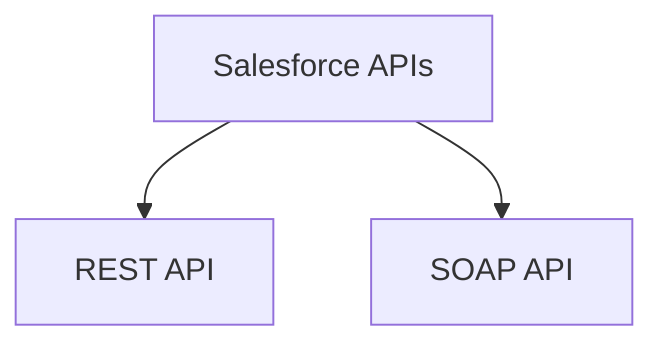
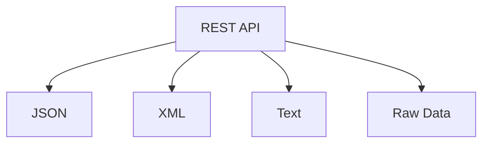
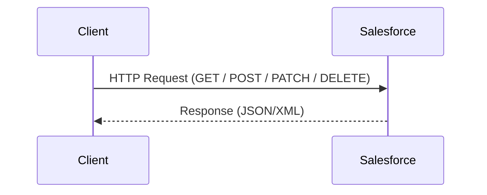
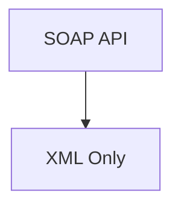
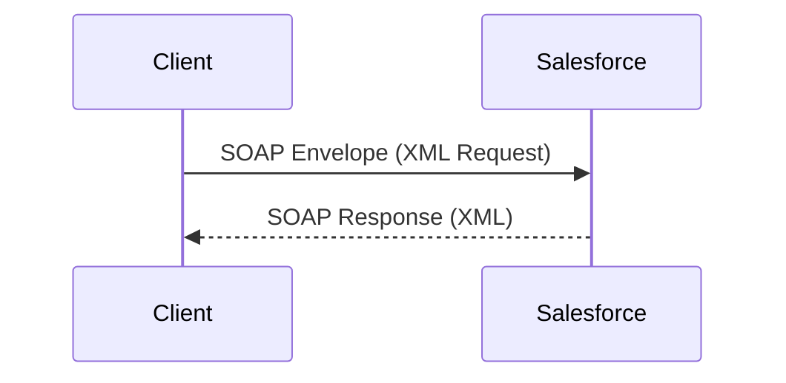
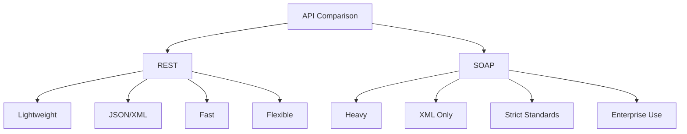
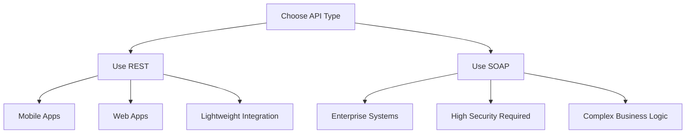

# REST API vs SOAP API

# 1. Overview

Salesforce supports multiple API architectures, with **REST** and **SOAP** being the most commonly used.

---

# 2. REST API (Representational State Transfer)

## Description

REST is a lightweight, flexible architectural style that uses standard HTTP methods to interact with resources. It is widely adopted for modern web and mobile applications.

## Key Characteristics

- Uses HTTP methods: `GET`, `POST`, `PATCH`, `DELETE`
- Stateless communication
- Resource-based URLs
- Supports multiple data formats:
  - JSON (most common)
  - XML
  - Plain text
  - Raw data

## Data Format

## Request-Response Flow

## Advantages

- Lightweight and fast
- Easy to integrate
- Human-readable data (JSON)
- Ideal for web, mobile, and microservices

## Limitations

- Less strict standards compared to SOAP
- Limited built-in security (relies on external mechanisms like OAuth)

---

# 3. SOAP API (Simple Object Access Protocol)

## Description

SOAP is a protocol-based API that uses structured XML messaging and strict standards. It is commonly used in enterprise-level and server-to-server integrations.

## Key Characteristics

- Protocol-based (not just architectural style)
- Uses XML exclusively
- Strong typing with WSDL (Web Services Description Language)
- Built-in error handling and standards

## Data Format

## Request-Response Flow

## Advantages

- Strong security standards (WS-Security)
- Reliable and consistent structure
- Supports complex transactions
- Suitable for enterprise integrations

## Limitations

- Heavy and verbose (XML-based)
- Slower compared to REST
- More complex to implement and maintain

---

# 4. REST vs SOAP Comparison

---

## Tabular Comparison

| Feature     | REST API                   | SOAP API                     |
| ----------- | -------------------------- | ---------------------------- |
| Type        | Architectural Style        | Protocol                     |
| Data Format | JSON, XML, Text, Raw       | XML Only                     |
| Performance | Fast and Lightweight       | Slower and Heavy             |
| Flexibility | High                       | Low (Strict Standards)       |
| Security    | OAuth, HTTPS               | WS-Security                  |
| Use Case    | Web, Mobile, Microservices | Enterprise, Server-to-Server |
| Complexity  | Easy                       | Complex                      |

---

# 5. When to Use What

---
