# Introduction to APIs and Salesforce Integration

## 1. Overview of APIs

An **Application Programming Interface (API)** enables communication between different software systems. In the Salesforce ecosystem, APIs facilitate integration with external systems, allowing data exchange and process automation.

### Key Capabilities

- Data operations (Create, Read, Update, Delete)
- Integration with third-party systems
- Process automation
- Real-time and asynchronous communication

---

## 2. Types of Salesforce Integration (Based on Authentication)

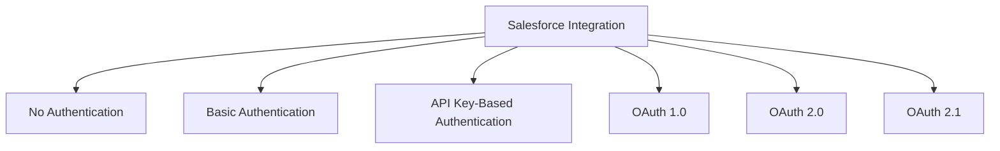

---

## 3. No Authentication

### Description

No authentication mechanism is used. Requests are made without credentials.

### Use Cases

- Public APIs
- Non-sensitive data access
- Testing environments

### Limitations

- Not secure for production systems

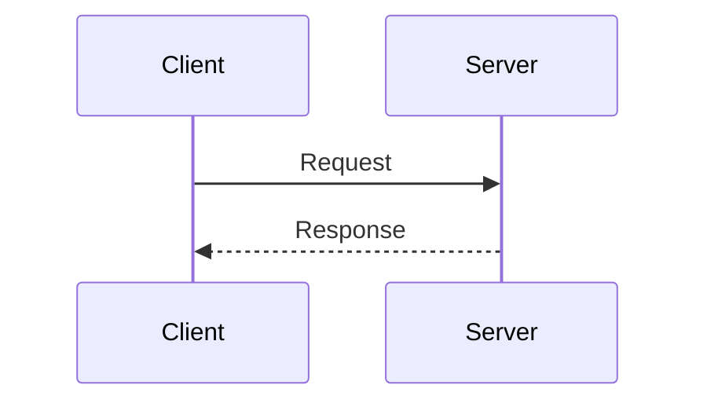

---

## 4. Basic Authentication

### Description

Uses a combination of username and password encoded in Base64 format.

### Use Cases

- Legacy systems
- Simple integrations

### Limitations

- Credentials are transmitted in headers
- Not recommended for modern secure applications

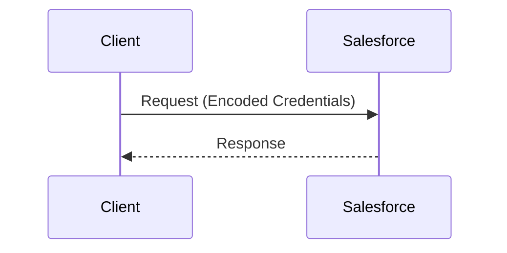

---

## 5. API Key-Based Authentication

### Description

Authentication is performed using a unique API key included in the request header.

### Use Cases

- Lightweight integrations
- Controlled API access

### Limitations

- Not natively supported in standard Salesforce APIs
- Requires custom implementation

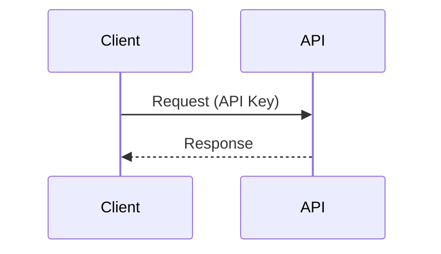

---

## 6. OAuth 1.0

### Description

A signature-based authentication mechanism involving a three-step (three-legged) process.

### Limitations

- Complex implementation
- Superseded by OAuth 2.0
- Not recommended for new integrations

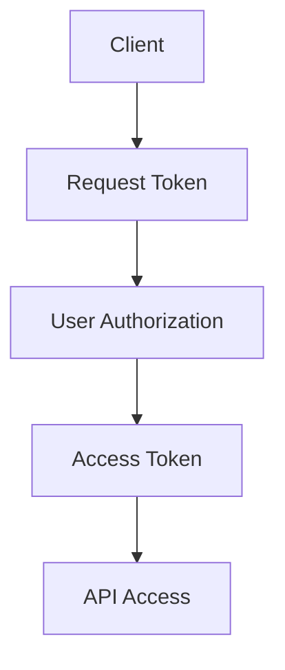

---

## 7. OAuth 2.0

### Description

OAuth 2.0 is the industry-standard protocol for secure authorization. It enables delegated access without exposing user credentials.

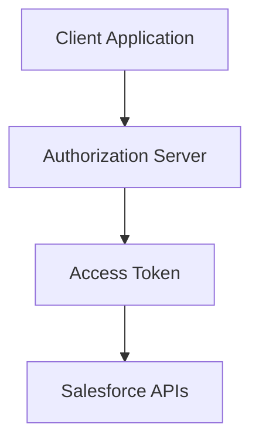

---

## 7.1 OAuth 2.0 Flows in Salesforce

### 7.1.1 Web Server Flow

#### Description

Used for server-side applications requiring secure token exchange.

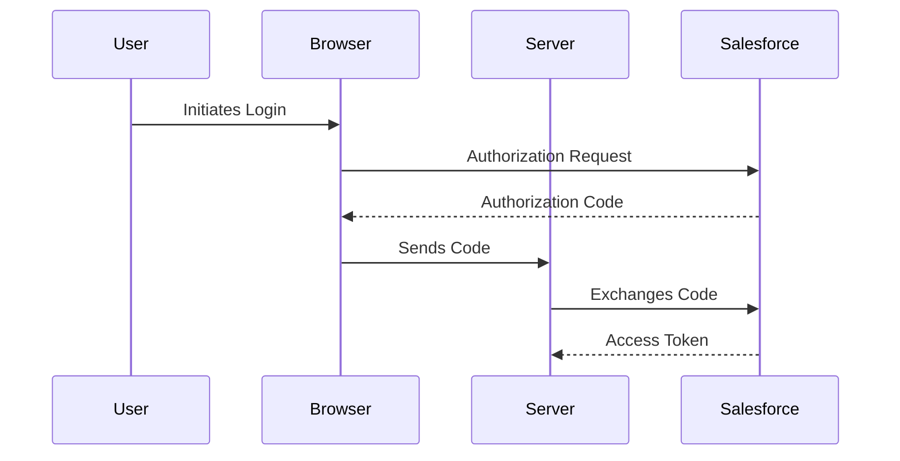

---

### 7.1.2 User-Agent Flow (Implicit Flow)

#### Description

Designed for client-side applications such as single-page applications.

#### Limitations

- Does not support refresh tokens
- Less secure compared to other flows

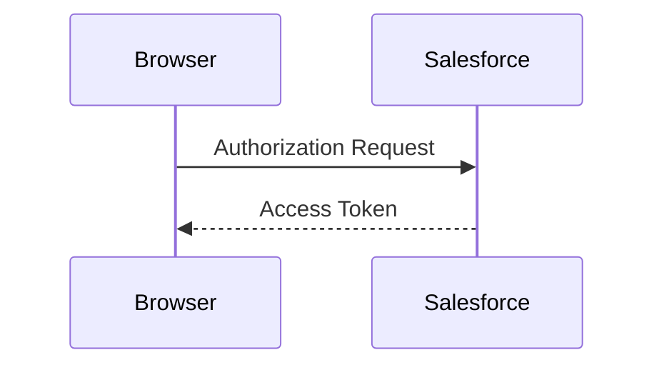

---

### 7.1.3 Username and Password Flow

#### Description

Allows direct exchange of user credentials for an access token.

#### Status

- Deprecated in Salesforce

#### Limitations

- Bypasses user interaction
- Presents security risks

---

### 7.1.4 Refresh Token Flow

#### Description

Used to obtain a new access token without requiring user reauthentication.

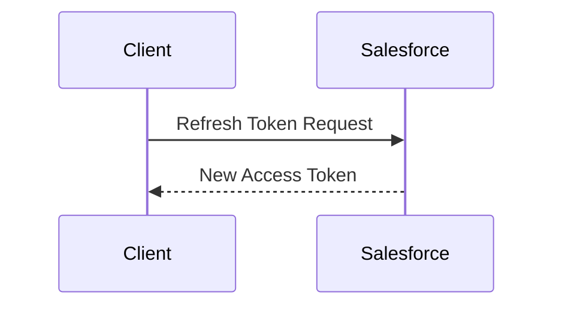

---

### 7.1.5 JWT Bearer Token Flow

#### Description

Used for server-to-server authentication without user interaction.

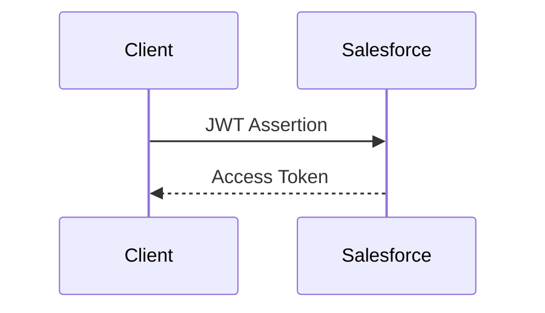

---

### 7.1.6 Client Credentials Flow

#### Description

Used for machine-to-machine communication without user context.

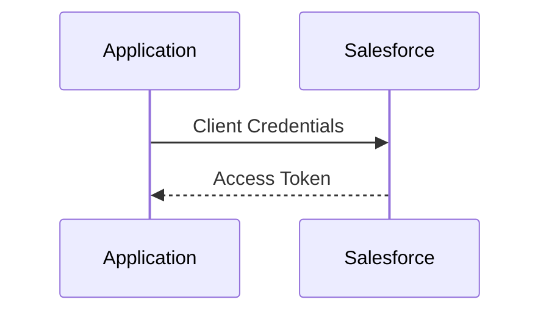

---

### 7.1.7 Device Flow

#### Description

Designed for devices with limited input capability such as IoT devices.

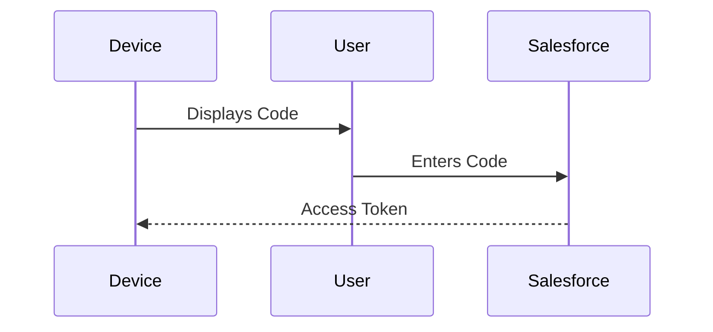

---

### 7.1.8 SAML Bearer Token Flow

#### Description

Uses SAML assertions for authentication.

#### Notes

- Limited usage in Salesforce integrations
- Typically used in enterprise SSO scenarios

---

### 7.1.9 PKCE (Proof Key for Code Exchange)

#### Description

Enhances security for public clients by mitigating authorization code interception.

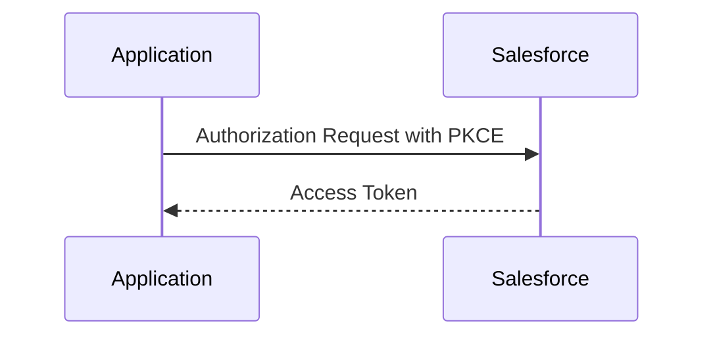

---

## 8. OAuth 2.1

### Description

OAuth 2.1 is an evolving standard that simplifies OAuth 2.0 and enforces stronger security practices.

### Key Improvements

- Removal of implicit flow
- Mandatory use of PKCE
- Enhanced security standards

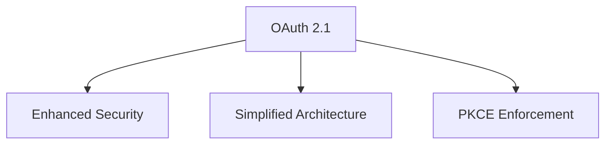

---

## 9. Summary

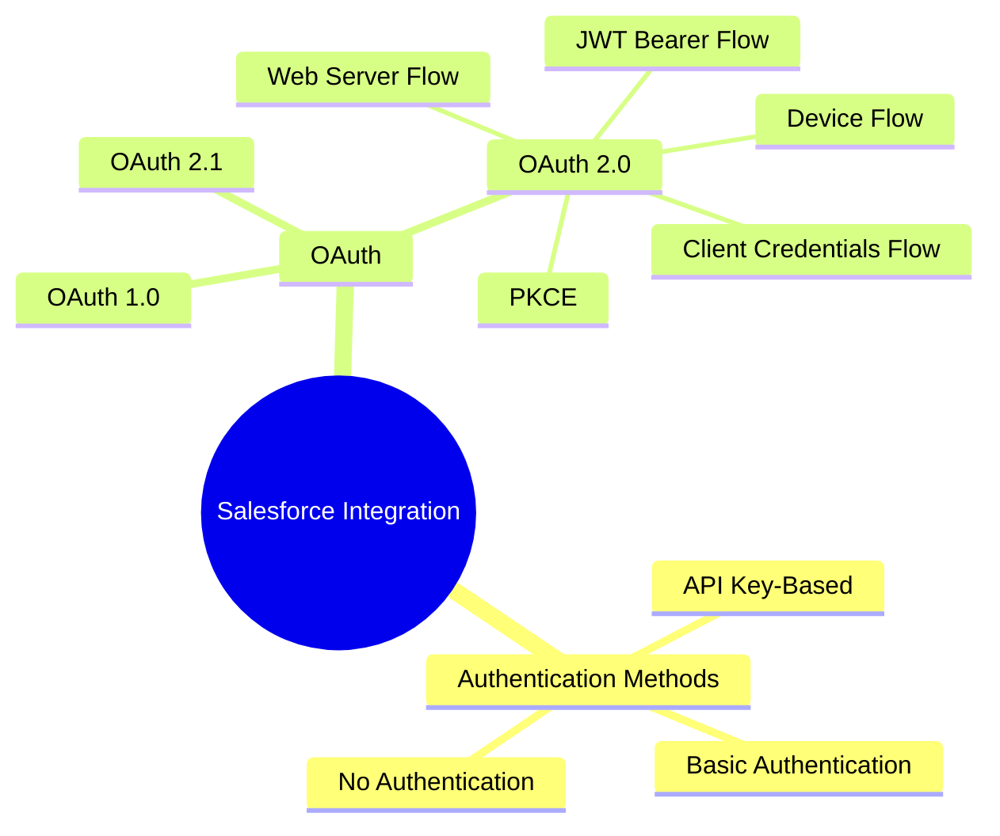

---
