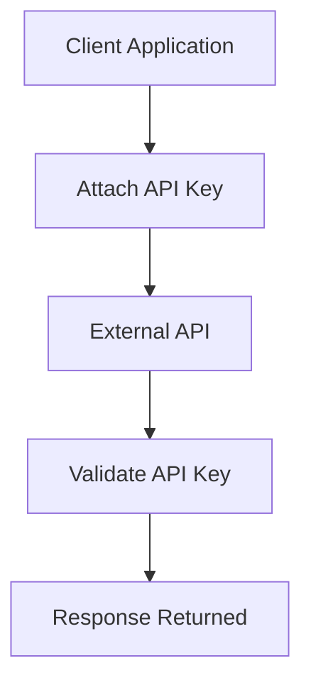
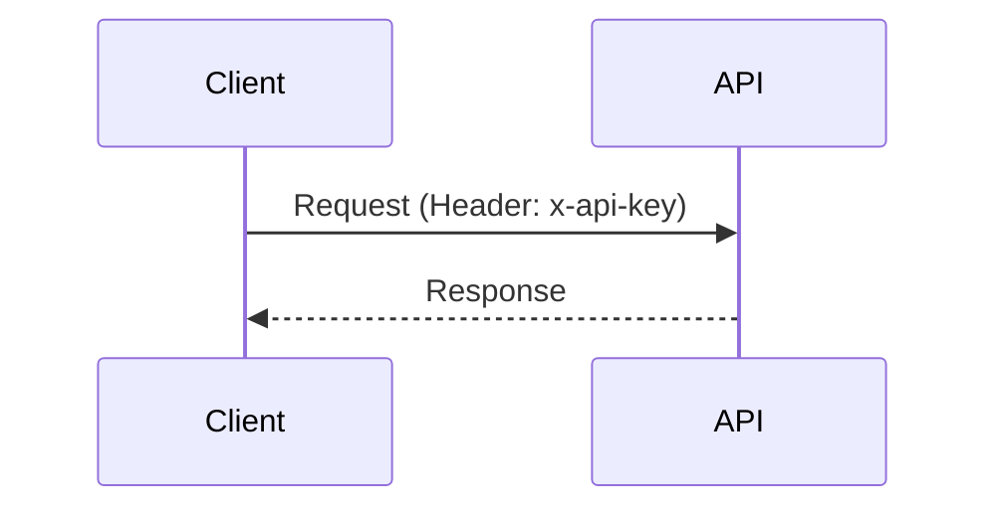
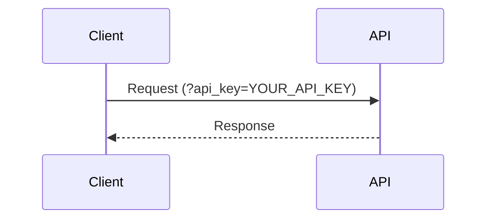
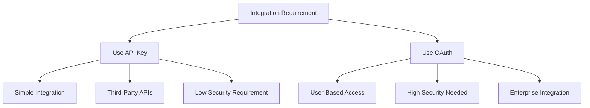

# API Key-Based Authentication

## Overview

API Key-based authentication is a simple mechanism where a unique key is used to authenticate requests between a client and an external service. The API key acts as an identifier for the calling application.



---

## Description

In this approach, the client includes an API key in each request. The server validates the key before processing the request.

API keys are typically passed in:

- Request headers
- Query parameters (less secure)

---

## Common Methods of Passing API Key

### Header-Based Authentication (Recommended)



Example header:

```
x-api-key: YOUR_API_KEY
```

---

### Query Parameter (Not Recommended)



Example URL:

```
https://api.example.com/data?api_key=YOUR_API_KEY
```

---

## Characteristics

- Simple and easy to implement
- No token exchange required
- Stateless authentication
- Suitable for lightweight integrations

---

## Limitations

- API key can be exposed if not secured properly
- No built-in user context
- Limited control over permissions
- Not suitable for high-security applications

---

## Usage in Salesforce

Salesforce does not natively use API key authentication for its standard APIs, but it is commonly used when:

- Calling third-party APIs from Apex
- Integrating with external services that require API keys

---

## Apex Callout Example with API Key

```apex
public class ApiKeyCalloutService {

    public static void fetchData() {

        HttpRequest req = new HttpRequest();
        req.setEndpoint('https://api.example.com/data');
        req.setMethod('GET');
        req.setHeader('Content-Type', 'application/json');

        // API Key Header
        req.setHeader('x-api-key', 'YOUR_API_KEY');

        Http http = new Http();

        try {
            HttpResponse res = http.send(req);

            if (res.getStatusCode() == 200) {
                System.debug('Success Response: ' + res.getBody());
            } else {
                System.debug('Error Code: ' + res.getStatusCode());
                System.debug('Error Response: ' + res.getBody());
            }

        } catch (System.CalloutException e) {
            System.debug('Callout Exception: ' + e.getMessage());

        } catch (Exception e) {
            System.debug('General Exception: ' + e.getMessage());
        }
    }
}
```

---

## Best Practices

- Store API keys securely using **Named Credentials** or **Custom Metadata**
- Avoid hardcoding API keys in Apex classes
- Always use HTTPS to encrypt requests
- Prefer header-based authentication over query parameters
- Rotate API keys periodically
- Restrict API key usage by IP or domain if supported

---

## When to Use



---

## Summary

- API key authentication is simple and lightweight
- Commonly used for third-party integrations
- Not suitable for sensitive or enterprise-grade security requirements
- In Salesforce, primarily used in outbound callouts to external APIs

---
