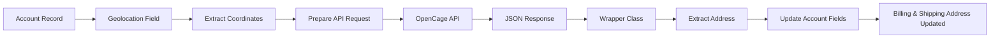
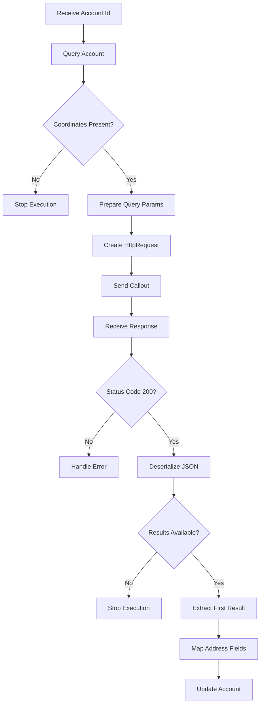
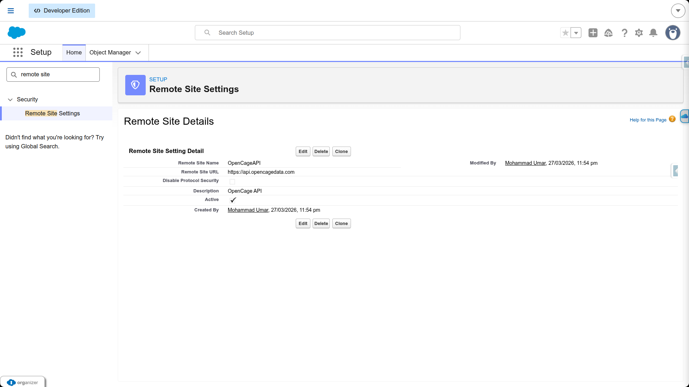
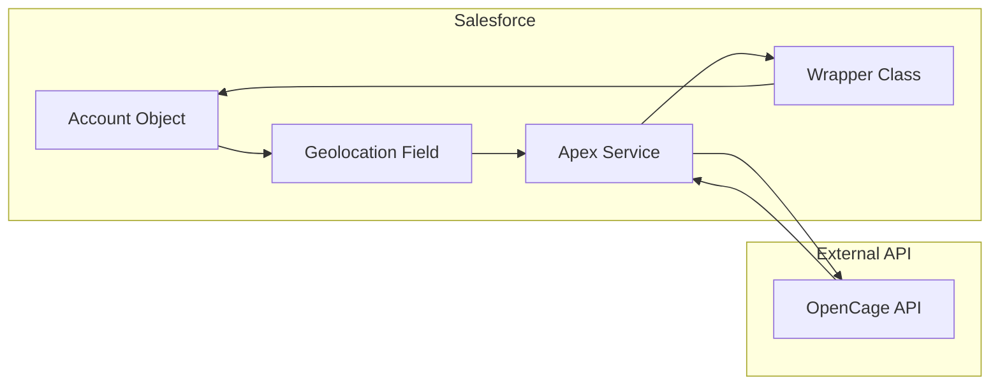
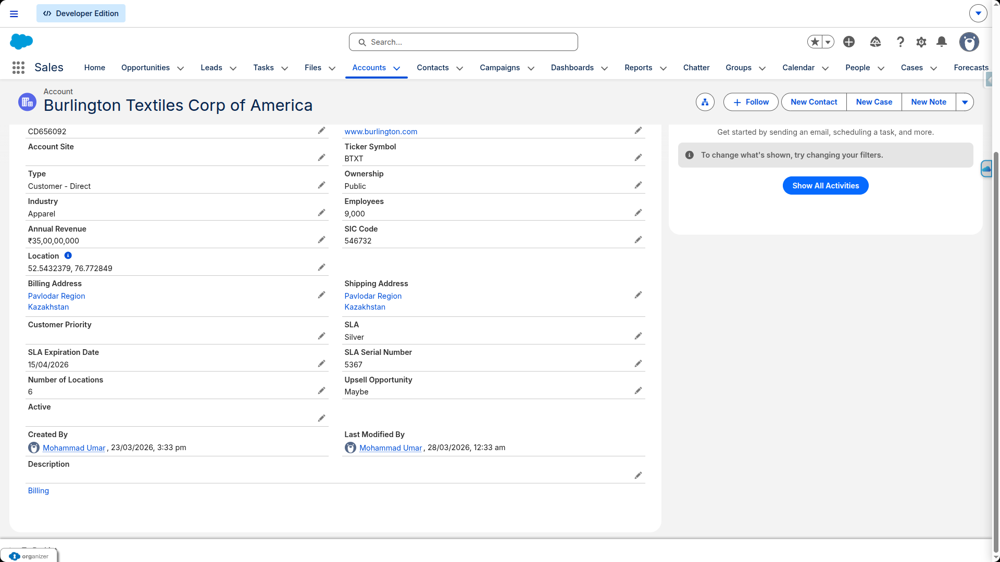

# OpenCage API Integeration (via API Keybase)

## Overview

This implementation demonstrates how to integrate the OpenCage API with Salesforce using Apex callouts. The goal is to convert latitude and longitude coordinates into a complete, human-readable address and store that information in the Account object.

```bash
REQUEST → Account Location → Coordinates → OpenCage API
RESPONSE → OpenCage API → JSON Object → Complete Address
```

An account is created on the OpenCage platform, which provides reverse geocoding capabilities. Using this service, we can pass coordinates and receive structured address data in response.

## Data Model



A custom field named `Location__c` of type Geolocation is created on the Account object. This field stores the latitude and longitude values of the user.Once the Account record is saved with valid coordinates, the record Id is manually passed as an argument to the Apex service class.

<strong>Package File : </strong>[Location.field-metadata.xml](../src/metadata/Location.field-metadata.xml)

## Flow

The Apex class retrieves the Account record using the provided Id and extracts the latitude and longitude values. These coordinates are then sent to the OpenCage API using an HTTP GET request.



The API responds with a JSON object containing detailed address information. This response is deserialized into a wrapper class and mapped to the corresponding Billing and Shipping address fields of the Account.

## Configuration

- OpenCage Base URL is stored in a Custom Label
- OpenCage API Key is stored securely in a Custom Label
- Remote Site Settings must be configured to allow outbound callouts

## Remote Site Settings

<details>
    <summary><strong>Add Remote Site in Salesforce</strong></summary>
    
</details>

## Apex Service Class

<details>
    <summary><strong>Code Logic</strong></summary>



</details>

```java
public with sharing class OpenCageGeocoderService {

    public static void reverseGeoCoding(String accountId){ // argument
        Account accRecord = [SELECT Id, Location__Latitude__s, Location__Longitude__s
                            FROM Account
                            WHERE Id =: accountId
                            AND Location__Latitude__s != null
                            AND Location__Longitude__s != null
                            LIMIT 1];

        String queryParams = accRecord.Location__Latitude__s+','+accRecord.Location__Longitude__s;

        HttpRequest httpReq = new HttpRequest();
        httpReq.setEndPoint(System.Label.OPENCAGE_API_URL+'?key='
            +System.Label.OPENCAGE_API_KEY+'&q='+queryParams+'&pretty=1');

        httpReq.setHeader('Content-Type', 'application/json');
        httpReq.setHeader('Accept', 'application/json');
        httpReq.setMethod('GET');

        Http htt = new Http();
        try {
            HttpResponse httpRes = htt.send(httpReq);

            String responseBody = httpRes.getBody();
            Integer statusCode  = httpRes.getStatusCode();

            if(statusCode == 200){
                OpenCageReverseResponseWrapper wrapper =
                (OpenCageReverseResponseWrapper)System.JSON.deserialize(
                    responseBody,
                    OpenCageReverseResponseWrapper.class
                );

                if(wrapper?.results?.size() > 0){
                    OpenCageReverseResponseWrapper.results rslt = wrapper.results.get(0);

                    accRecord.BillingStreet = rslt?.components?.road;
                    accRecord.BillingCity = rslt?.components?.city;
                    accRecord.BillingState = rslt?.components?.state;
                    accRecord.BillingPostalCode = rslt?.components?.postcode;
                    accRecord.BillingCountry = rslt?.components?.country;

                    accRecord.ShippingStreet = rslt?.components?.road;
                    accRecord.ShippingCity = rslt?.components?.city;
                    accRecord.ShippingState = rslt?.components?.state;
                    accRecord.ShippingPostalCode = rslt?.components?.postcode;
                    accRecord.ShippingCountry = rslt?.components?.country;

                    update accRecord;
                }
            }else{
                // error handling
            }

        }catch(System.CalloutException calloutEx){
            System.debug('System.CalloutException .... '+ calloutEx.getStackTraceString());
        }catch(System.Exception ex){
            System.debug('Exception Executed ... '+ ex.getStackTraceString());
        }
    }
}
```

## Wrapper Class

```java
public class OpenCageReverseResponseWrapper{
	public results[] results;

	public class results {
		public components components;
		public Integer confidence;
		public String formatted;
		public geometry geometry;
	}

	public class components {
		public String city;
		public String city_district;
		public String continent;
		public String country;
		public String country_code;
		public String county;
		public String house_number;
		public String office;
		public String political_union;
		public String postcode;
		public String road;
		public String state;
		public String state_code;
		public String suburb;
	}

	public class geometry {
		public Double lat;
		public Double lng;
	}
}
```

<strong>Code File</strong> : [OpenCageGeocoderService.cls](../src/code/OpenCageGeocoderService.cls)<br>
<strong>Code File</strong> : [OpenCageReverseResponseWrapper.cls](../src/code/OpenCageReverseResponseWrapper.cls)<br>

## Final Record View

<details>
    <summary><strong>View</strong></summary>
    
</details>

### Tip

Use Admin Booster to Generate Wrapper Class & Beautify JSON to what to get according to your requirement.
