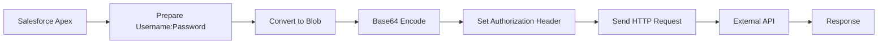
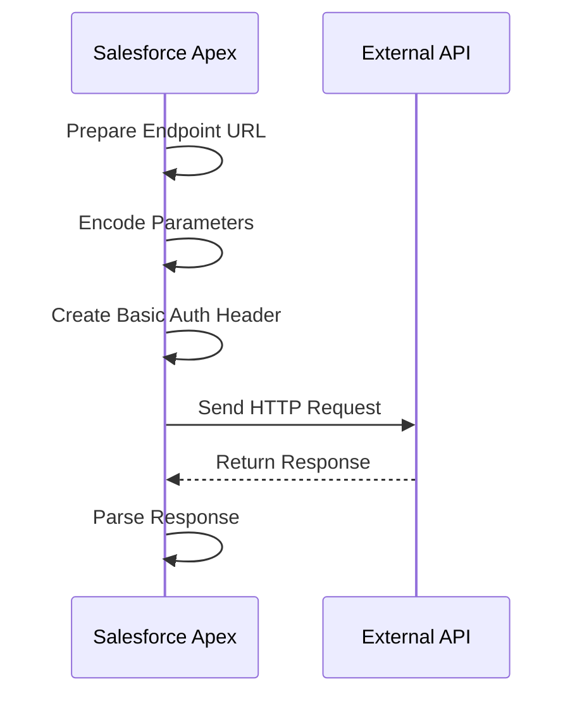
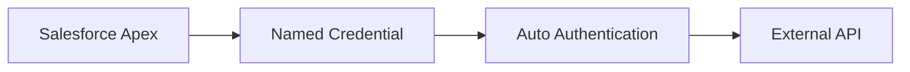

# Basic Authentication Integration in Salesforce

Basic Authentication is one of the simplest ways to authenticate an API call. It works by sending a username and password (or token) encoded in Base64 format in the HTTP header.

In Salesforce, this is commonly used when integrating with external APIs that still support Basic Auth.

---

## How Basic Authentication Works

The client sends credentials in this format:

```
Authorization: Basic Base64(username:password)
```

Salesforce Apex must manually construct this header.

### Flow Overview



---

## Apex Implementation

### Step-by-step logic

- Combine username and password using `:`
- Convert string → Blob
- Encode Blob → Base64
- Add to HTTP Header
- Send request

### Example Code

```java
public with sharing class BasicAuthCallout {

    public static void makeCallout() {

        String username = 'your_username';
        String password = 'your_password';

        String authString = username + ':' + password;

        Blob authBlob = Blob.valueOf(authString);
        String authHeader = 'Basic ' + EncodingUtil.base64Encode(authBlob);

        HttpRequest req = new HttpRequest();
        req.setEndpoint('https://api.example.com/data');
        req.setMethod('GET');
        req.setHeader('Authorization', authHeader);
        req.setHeader('Content-Type', 'application/json');

        Http http = new Http();
        HttpResponse res = http.send(req);

        System.debug(res.getBody());
    }
}
```

---

## Endpoint URL Preparation

Endpoint URL is the API address where Salesforce sends the request.

### Types of Endpoint Preparation

#### Static Endpoint

```
https://api.example.com/users
```

#### Dynamic Endpoint with Query Params

```
https://api.example.com/users?city=Pune&status=active
```

In Apex:

```java
String endpoint = 'https://api.example.com/users?city=' + EncodingUtil.urlEncode('Pune', 'UTF-8');
req.setEndpoint(endpoint);
```

---

## URL Encoding & Decoding

When sending data in URLs, special characters must be encoded.

### Why Encoding is Required

Characters like space, &, =, ?, / can break URLs.

### Encoding Example

```java
Original: Pune City
Encoded: Pune%20City
```

### Apex Methods

```java
String encoded = EncodingUtil.urlEncode('Pune City', 'UTF-8');
String decoded = EncodingUtil.urlDecode(encoded, 'UTF-8');
```

---

## Complete Integration Flow



---

## Problems with Basic Authentication

Basic Auth is simple but has major drawbacks:

- Credentials are sent in every request
- Easy to decode Base64 (not encrypted)
- Vulnerable to interception if not using HTTPS
- Risk of impersonation

---

## Enhanced Version: API Token-Based Basic Authentication

Instead of using actual password, modern systems use API Tokens.

### Concept

```java
Authorization: Basic Base64(username:API_TOKEN)
```

### Benefits

- No real password exposure
- Tokens can be revoked anytime
- Limited scope access
- Safer for integrations

---

## How to Create API Token-Based Integration

### On External Platform

- Generate API Token from user account
- Example platforms:
  - GitHub
  - OpenCage
  - Stripe

---

## Salesforce Implementation

Replace password with API token:

```java
String username = 'your_username';
String apiToken = 'your_api_token';

String authString = username + ':' + apiToken;

Blob authBlob = Blob.valueOf(authString);
String authHeader = 'Basic ' + EncodingUtil.base64Encode(authBlob);
```

---

## Secure Way to Store Credentials in Salesforce

Never hardcode credentials.

### Use Named Credentials

- Store endpoint + authentication
- Salesforce automatically handles headers

### Benefits

- No hardcoding
- Easy maintenance
- Secure storage

---

## Named Credential Flow



---

## What You Do vs How You Do

### What You Do

- Identify API endpoint
- Prepare authentication
- Encode credentials
- Send request
- Handle response

### How You Do

- Use Apex Http classes
- Use EncodingUtil for encoding
- Use Base64 for auth header
- Use Named Credentials for security
- Use API tokens instead of passwords

---
