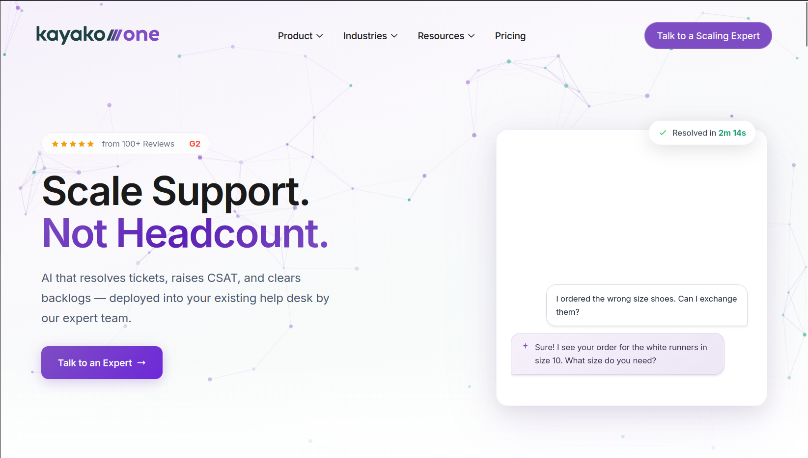

# Kayako API Integration

### Overview of Kayako

Kayako is an AI-driven help desk and customer support platform designed to streamline customer service, support, and communication.
It centralizes email, chat, and social media tickets into a single inbox, using AI to automate workflows, route tickets, and suggest fast, accurate responses to improve customer satisfaction. 

---

**Key Features and Capabilities:** 

- **AI Support & Automation:** Features AI Triage to automatically classify, prioritize, and route tickets, and AI Answers to assist agents with draft replies.
- **Shared Inbox & Ticketing:** Unifies support channels (email, live chat, social media) into a single, cohesive view for staff.
- **Self-Service Knowledge Base:** Helps build, maintain, and suggest updates for public or private help centers to improve self-service.
- **Proactive Messaging:** Allows businesses to engage with visitors through Messenger chat on their website.
- **Unified Agent Experience:** Enables teams to manage conversations efficiently, reducing handle time and reducing the need to increase headcount.

### Available API Endpoints

<strong>Core</strong>

- [Users](https://developer.kayako.com/api/v1/users/activities/)
- [Cases](https://developer.kayako.com/api/v1/cases/activities/)
- [Insights](https://developer.kayako.com/api/v1/insights/cases/)
- [Search](https://developer.kayako.com/api/v1/search/search/)
- [Automation](https://developer.kayako.com/api/v1/automation/endpoints/)

<strong>Channels</strong>

- [Mail](https://developer.kayako.com/api/v1/mail/mailboxes/)
- [Twitter](https://developer.kayako.com/api/v1/twitter/accounts/)
- [Help Center](https://developer.kayako.com/api/v1/help_center/articles/)
- [Facebook](https://developer.kayako.com/api/v1/facebook/accounts/)
- [Event](https://developer.kayako.com/api/v1/event/events/)

<strong>Other</strong>

- [General](https://developer.kayako.com/api/v1/general/autocomplete/)

PENDING DEVELOPMENT .... PROCESS IS RUNNING!

INSPIRATION UNDER WAY!