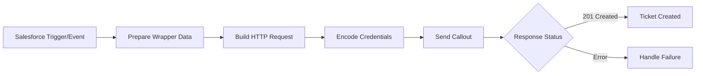
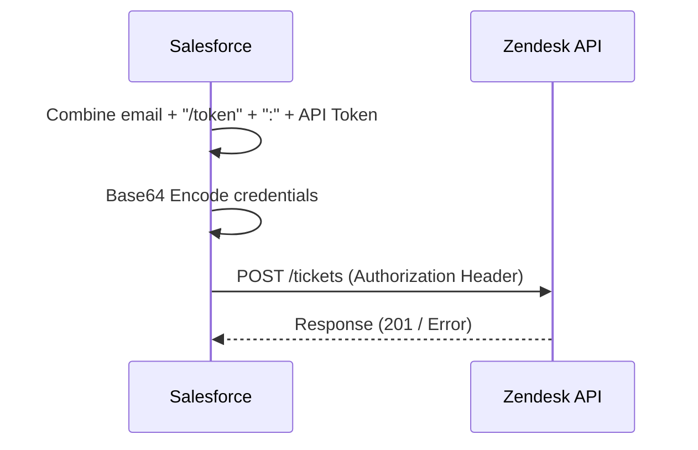

# Zendesk API Integration

### Overview of Zendesk

Zendesk is a cloud-based customer service and engagement platform that helps businesses manage customer support, sales, and communication across multiple channels (email, chat, phone, social media) in one centralized hub.
It streamlines support through automated ticketing, AI-powered bots, and knowledge bases to improve efficiency and customer experience.


Key capabilities of Zendesk include:

- <strong>Omnichannel Support</strong>: Consolidates inquiries from email, voice, SMS, social media, and live chat into a single interface.
- <strong>Ticketing System</strong>: Tracks, prioritizes, and resolves customer issues efficiently.
- <strong>AI and Automation</strong>: Uses bots to resolve common queries instantly, reducing agent workload.
- <strong>Help Center & Community Forums</strong>: Allows businesses to create self-service portals and community forums.
- <strong>Zendesk Sell</strong>: A CRM component to enhance sales team productivity and pipeline visibility.
- <strong>Analytics & Reporting</strong>: Provides detailed insights into support operations and customer satisfaction

## Ticketing in Zendesk

Zendesk ticketing is a centralized, AI-powered system that converts customer inquiries from multiple channels—email, chat, phone, and social media—into individual tickets.
It serves as a unified workspace for agents to track, prioritize, and resolve issues, allowing them to manage complex conversations efficiently and improve customer satisfaction.

**Key Components of Zendesk Ticketing:** 

- **Centralized Inbox:** Collects requests from multiple channels (email, X, Facebook, phone) into one workspace, transforming them into manageable tickets.
- **Ticket Lifecycle:** Tickets go through stages: **New** (unassigned), **Open** (being addressed), **Pending** (awaiting customer input), and **Solved** (issue resolved).
- **Customer Context:** Agents have access to the user's profile and communication history in the sidebar, enhancing personalized support.
- **Internal Notes:** Allows team members to collaborate on a ticket without the customer seeing the internal communication.
- **Automation & Organization:** Uses triggers, automations, and tags to automate workflows, categorize requests, and assign them to the right agents based on expertise.
- **Ticket Fields & Tags:** Customizable fields capture specific data (e.g., ticket type, urgency), while tags categorize tickets for better tracking and automation.
- **[Reporting & Analytics](https://www.google.com/search?q=Reporting+%26+Analytics&oq=what+is+ticketing+in+zendesk&gs_lcrp=EgZjaHJvbWUyBggAEEUYOTIICAEQABgWGB4yCAgCEAAYFhgeMggIAxAAGBYYHjIICAQQABgWGB4yDQgFEAAYhgMYgAQYigUyDQgGEAAYhgMYgAQYigUyDQgHEAAYhgMYgAQYigUyDQgIEAAYhgMYgAQYigUyBggJEC4YQNIBCDU4NjlqMGoxqAIAsAIA&sourceid=chrome&ie=UTF-8&mstk=AUtExfBrES8DTPekAzuiyN_wUf77ZY_fFT8jIAs_Lq2sflQAWSubR5-ttxHFf2iT56QR7IYNHlJ4WeUGvFPnLF1HbOGSFWBsAt6G2HLhrYiq535UICAlw_0vb7W1y3TWxapZe9Y_VmqPqJr1xhLyYn2O2V7O6dHw0SYCHTARsZ0SL0pLwuU&csui=3&ved=2ahUKEwiBofPtlcyTAxWDaCoJHYonO48QgK4QegQIAxAH):** Provides insights into agent performance, resolution times, and common customer issues

Work with tickets, users and organizations and manage ticket workflows.

<strong>Click Here </strong> : [Zendesk Ticket API Docs](https://developer.zendesk.com/api-reference/ticketing/tickets/tickets/)

## Zendesk Ticket Creation using API Token (Basic Auth) in Salesforce

## Overview

This implementation integrates Salesforce with Zendesk to automatically create tickets using **API Token-based Basic Authentication**.

Zendesk recommends API tokens over password-based authentication because:

- More secure than passwords
- Can be revoked independently
- Suitable for integrations and automation

---

## Authentication Strategy

Zendesk uses a modified Basic Auth format:

```bash
{email}/token:{api_token}
```

This string is Base64 encoded and passed in the Authorization header.

### Example

```bash
username/token:api_token
```

Encoded:

```bash
Authorization: Basic <Base64EncodedValue>
```

---

## Configuration

### Custom Labels Used

| Label Name       | Description                  |
| ---------------- | ---------------------------- |
| ZENDESK_URL      | Base URL of Zendesk instance |
| ZENDESK_USERNAME | Zendesk user email           |
| ZENDESK_TOKEN    | Zendesk API token            |

---

## Request Structure

### Endpoint

```bash
POST /api/v2/tickets
```

### Headers

```bash
Content-Type: application/json
Accept: application/json
Authorization: Basic <encoded_credentials>
```

---

## Request Body Structure

```json
{
  "ticket": {
    "comment": {
      "body": "Issue description"
    },
    "priority": "high",
    "subject": "Ticket subject",
    "requester": {
      "locale_id": 8,
      "name": "Customer Name",
      "email": "customer@email.com"
    }
  }
}
```

---

## Apex Implementation

### Core Utility Class

```java
public with sharing class ZendeskTicketUtils {

    public class TicektWrapper {
        public String body;
        public String subject;
        public String priority;
        public String name;
        public String email;
    }

    public static void createTicket(TicektWrapper wrapper) {

        String endPoint = System.Label.ZENDESK_URL + 'api/v2/tickets';
        String header = System.Label.ZENDESK_USERNAME + '/token' + ':' + System.Label.ZENDESK_TOKEN;

        String requestBody = '{'+
        '    "ticket": {'+
        '        "comment": {'+
        '            "body": "'+wrapper.body+'"'+
        '        },'+
        '        "priority": "'+wrapper.priority+'",'+
        '        "subject": "'+wrapper.subject+'",'+
        '        "requester": {'+
        '            "locale_id": 8,'+
        '            "name": "'+wrapper.name+'",'+
        '            "email": "'+wrapper.email+'"'+
        '        }'+
        '    }'+
        '}';

        HttpRequest request = new HttpRequest();
        request.setEndPoint(endPoint);
        request.setMethod('POST');
        request.setHeader('Content-Type','application/json');
        request.setHeader('Accept','application/json');
        request.setHeader('Authorization', 'Basic ' + EncodingUtil.base64Encode(Blob.valueOf(header)));
        request.setBody(requestBody);

        try {
            HttpResponse response = (new HTTP()).send(request);

            if(response.getStatusCode() == 201) {
                System.debug('SUCCESS : ' + response.getBody());
            } else {
                System.debug('FAILED : ' + response.getBody());
            }

        } catch(Exception e) {
            System.debug('Failed Callout! ' + e.getMessage());
        }
    }
}
```

<strong>Code File :</strong> [ZendeskTickeUtils](../src/code/ZendeskTicketUtils.cls)<br>

## Wrapper-Based Request Model (Recommended)

Instead of manual JSON construction, this wrapper improves maintainability and scalability.

```java
public with sharing class ZendeskTiketInputWrapper {

    public ticket ticket;

    public class ticket {
        public String subject;
        public String priority;
        public String type;
        public comment comment;
        public String assignee_id;
        public requester requester;
    }

    public class comment {
        public String body;
    }

    public class requester {
        public Integer locale_id;
        public String name;
        public String email;
    }
}
```

<strong>Code File :</strong> [ZendeskTicketWrapper](../src/code/ZendeskTiketInputWrapper.cls)<br>

---

## Recommended Improvement

### Use JSON.serialize instead of String Concatenation

Problem with current approach:

- Error-prone
- Difficult to maintain
- Risk of malformed JSON

Better approach:

```java
ZendeskTiketInputWrapper wrapperObj = new ZendeskTiketInputWrapper();
wrapperObj.ticket = new ZendeskTiketInputWrapper.ticket();
wrapperObj.ticket.subject = 'Test Ticket';
wrapperObj.ticket.priority = 'high';

wrapperObj.ticket.comment = new ZendeskTiketInputWrapper.comment();
wrapperObj.ticket.comment.body = 'Issue description';

wrapperObj.ticket.requester = new ZendeskTiketInputWrapper.requester();
wrapperObj.ticket.requester.name = 'Umar';
wrapperObj.ticket.requester.email = 'umar@test.com';
wrapperObj.ticket.requester.locale_id = 8;

String requestBody = JSON.serialize(wrapperObj);
```

---

## Execution Flow



---

## Authentication Flow



---

## Creating Zendesk Ticket Triggers

```java
public with sharing class CaseTriggerHandler {

    public static void handleAfterInsert(List<Case> newRecords) {
        if(System.isFuture() || System.isBatch()){
            return;
        }

        for(Case c : newRecords){ // make a SQOL Query to get the Contact Details
            PS_ZendeskTicketUtils.TicektWrapper wrapper = new PS_ZendeskTicketUtils.TicektWrapper();
            wrapper.body     = c.Description;
            wrapper.subject  = c.Subject;
            wrapper.priority = c.Priority.toLowerCase(); // Allowed values are "urgent", "high", "normal", or "low".
            wrapper.name     = 'Amit Singh';
            wrapper.email    = 'asingh@example.org';
            // Converting the Object into String
            makeCallout( JSON.serialize(wrapper) );
        }
    }

    @future(callout = true) // THIS is not the best Solution
    private static void makeCallout(String params){
        // Convert the String in object(class)
        PS_ZendeskTicketUtils.TicektWrapper wrapper = (PS_ZendeskTicketUtils.TicektWrapper)JSON.deserialize(params, PS_ZendeskTicketUtils.TicektWrapper.class);
        PS_ZendeskTicketUtils.createTicket(wrapper);
    }
}
```

<strong>Code File :</strong> [CaseTriggerHandler](../src/code/CaseTriggerHandler.cls)<br>

## Key Concept

### Why API Token over Password

- Password exposure risk is eliminated
- Token can be revoked anytime
- Supports secure integrations
- Industry best practice

---

### Common Mistakes to Avoid

- Missing `/token` in username
- Incorrect Base64 encoding
- Hardcoding credentials instead of using Custom Labels
- Manual JSON construction instead of serialization
- Not handling non-201 responses properly

---

## Pro Developer Tips

- Always use **Named Credentials** instead of manual auth (future improvement)
- Log only necessary data (avoid exposing tokens)
- Add retry logic for failed callouts
- Store response in a custom object for audit tracking
- Use Queueable Apex for async callouts

---
