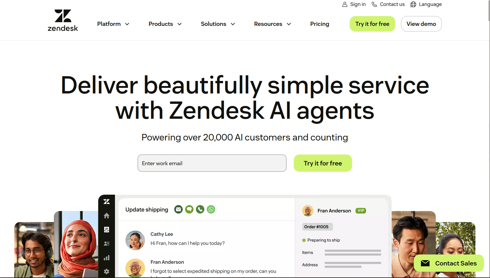

# Zendesk API Integration

### Overview of Zendesk

Zendesk is a cloud-based customer service and engagement platform that helps businesses manage customer support, sales, and communication across multiple channels (email, chat, phone, social media) in one centralized hub.
It streamlines support through automated ticketing, AI-powered bots, and knowledge bases to improve efficiency and customer experience.

Key capabilities of Zendesk include:

- <strong>Omnichannel Support</strong>: Consolidates inquiries from email, voice, SMS, social media, and live chat into a single interface.
- <strong>Ticketing System</strong>: Tracks, prioritizes, and resolves customer issues efficiently.
- <strong>AI and Automation</strong>: Uses bots to resolve common queries instantly, reducing agent workload.
- <strong>Help Center & Community Forums</strong>: Allows businesses to create self-service portals and community forums.
- <strong>Zendesk Sell</strong>: A CRM component to enhance sales team productivity and pipeline visibility.
- <strong>Analytics & Reporting</strong>: Provides detailed insights into support operations and customer satisfaction

## Ticketing in Zendesk

Zendesk ticketing is a centralized, AI-powered system that converts customer inquiries from multiple channels—email, chat, phone, and social media—into individual tickets.
It serves as a unified workspace for agents to track, prioritize, and resolve issues, allowing them to manage complex conversations efficiently and improve customer satisfaction.

**Key Components of Zendesk Ticketing:** 

- **Centralized Inbox:** Collects requests from multiple channels (email, X, Facebook, phone) into one workspace, transforming them into manageable tickets.
- **Ticket Lifecycle:** Tickets go through stages: **New** (unassigned), **Open** (being addressed), **Pending** (awaiting customer input), and **Solved** (issue resolved).
- **Customer Context:** Agents have access to the user's profile and communication history in the sidebar, enhancing personalized support.
- **Internal Notes:** Allows team members to collaborate on a ticket without the customer seeing the internal communication.
- **Automation & Organization:** Uses triggers, automations, and tags to automate workflows, categorize requests, and assign them to the right agents based on expertise.
- **Ticket Fields & Tags:** Customizable fields capture specific data (e.g., ticket type, urgency), while tags categorize tickets for better tracking and automation.
- **[Reporting & Analytics](https://www.google.com/search?q=Reporting+%26+Analytics&oq=what+is+ticketing+in+zendesk&gs_lcrp=EgZjaHJvbWUyBggAEEUYOTIICAEQABgWGB4yCAgCEAAYFhgeMggIAxAAGBYYHjIICAQQABgWGB4yDQgFEAAYhgMYgAQYigUyDQgGEAAYhgMYgAQYigUyDQgHEAAYhgMYgAQYigUyDQgIEAAYhgMYgAQYigUyBggJEC4YQNIBCDU4NjlqMGoxqAIAsAIA&sourceid=chrome&ie=UTF-8&mstk=AUtExfBrES8DTPekAzuiyN_wUf77ZY_fFT8jIAs_Lq2sflQAWSubR5-ttxHFf2iT56QR7IYNHlJ4WeUGvFPnLF1HbOGSFWBsAt6G2HLhrYiq535UICAlw_0vb7W1y3TWxapZe9Y_VmqPqJr1xhLyYn2O2V7O6dHw0SYCHTARsZ0SL0pLwuU&csui=3&ved=2ahUKEwiBofPtlcyTAxWDaCoJHYonO48QgK4QegQIAxAH):** Provides insights into agent performance, resolution times, and common customer issues

Work with tickets, users and organizations and manage ticket workflows.

<strong>Click Here </strong> : [Zendesk Ticket API Docs](https://developer.zendesk.com/api-reference/ticketing/tickets/tickets/)
