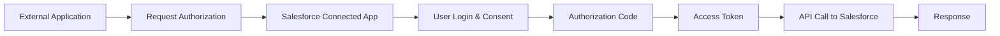
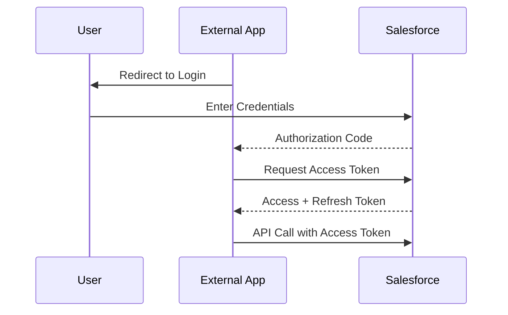
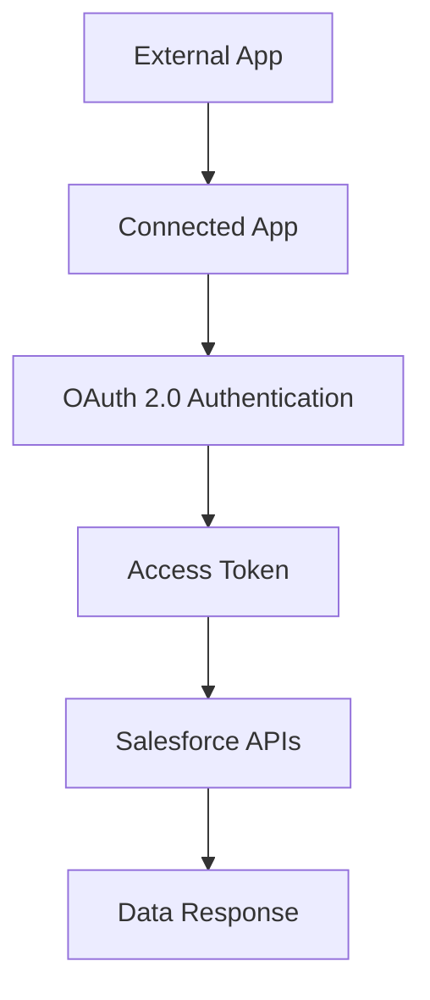

# Salesforce Connected Application

A Connected App in Salesforce is a configuration that allows external systems (or even internal apps like LWC, mobile apps) to securely connect with Salesforce using APIs.

It acts as a bridge between Salesforce and external platforms using authentication protocols like OAuth 2.0.

---

## Why We Use Connected Applications

Connected Apps are mainly used when secure, scalable, and controlled access is required.

### Core Reasons

- Enable external systems to access Salesforce APIs
- Provide secure authentication using OAuth 2.0
- Control access using scopes and policies
- Allow mobile apps, web apps, or backend systems to integrate

### Real-world Example

- A Node.js backend calling Salesforce APIs
- A mobile app accessing Salesforce data
- Integration between Salesforce and third-party platforms like OpenCage

---

## How Connected App Works



---

## What We Get After Connecting an Application

Once a Connected App is configured and authorized, Salesforce provides:

### Consumer Key & Consumer Secret

- Consumer Key → Client ID
- Consumer Secret → Client Secret

Used to identify the external application.

---

### Access Token

- Used to access Salesforce APIs
- Short-lived

---

### Refresh Token

- Used to generate a new access token
- Long-lived

---

### Instance URL

- Tells where to send API requests

Example:

```bash
https://yourInstance.salesforce.com
```

---

### Example API Call

```bash
GET /services/data/v60.0/sobjects/Account
Authorization: Bearer ACCESS_TOKEN
```

---

## OAuth 2.0 Flow in Connected App

Salesforce supports multiple OAuth flows:

- Authorization Code Flow
- Username-Password Flow
- JWT Bearer Flow
- Client Credentials Flow

---

### Standard OAuth Flow



---

## How We Manage Connected Applications

Salesforce provides multiple controls to manage security and usage.

### OAuth Policies

- Permitted Users (Admin approved / All users)
- IP Relaxation
- Token Expiry Settings
- Refresh Token Policy

---

### Scopes (Permissions)

Define what the app can access:

- `api` → Full API access
- `refresh_token` → Allow token refresh
- `openid` → Identity access

---

### Monitoring & Control

- View active users
- Revoke tokens
- Monitor usage

---

### Profiles & Permission Sets

Control which users can access the Connected App.

---

## If Connected App Has Multiple Endpoints

Connected App itself does NOT store multiple endpoints.

Instead:

- You get one base instance URL
- You construct endpoints dynamically

### Example

```bash
Base URL: https://yourInstance.salesforce.com

Endpoints:
- /services/data/v60.0/sobjects/Account
- /services/data/v60.0/query?q=SELECT+Name+FROM+Account
```

---

### How You Handle Multiple Endpoints in Salesforce

#### Approach

- Store base URL
- Append resource paths dynamically

```java
String baseUrl = 'https://yourInstance.salesforce.com';

String accountsEndpoint = baseUrl + '/services/data/v60.0/sobjects/Account';
String queryEndpoint = baseUrl + '/services/data/v60.0/query?q=SELECT+Name+FROM+Account';
```

---

### Alternative (Best Practice)

Use Named Credentials:

- Store base URL
- Use relative paths in Apex

```java
req.setEndpoint('callout:My_Named_Credential/services/data/v60.0/sobjects/Account');
```

---

## Limitations of Connected Applications

### Security Complexity

- Requires proper configuration
- Misconfigured scopes can expose data

---

### Token Management Overhead

- Need to handle token expiry
- Refresh logic required

---

### Dependency on OAuth Flow

- More complex than Basic Auth
- Requires redirects or backend handling

---

### Rate Limits

- Salesforce API limits still apply

---

### Not Suitable for Simple Use Cases

- Overkill for basic integrations
- Basic Auth or API keys might be simpler

---

## Complete Architecture Overview



---

## What You Do vs How You Do

### What You Do

- Register Connected App
- Configure OAuth scopes
- Authenticate using OAuth flow
- Use access token to call APIs

---

### How You Do

- Use Consumer Key & Secret
- Handle token exchange
- Store tokens securely
- Use Named Credentials for clean integration

---
