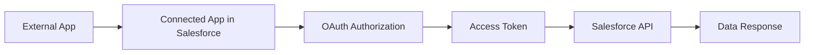
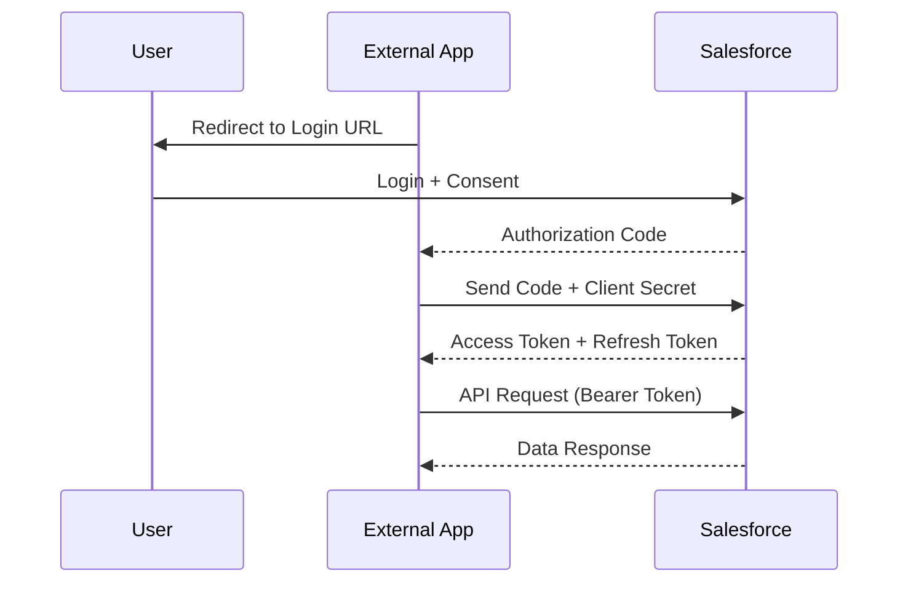
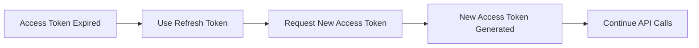
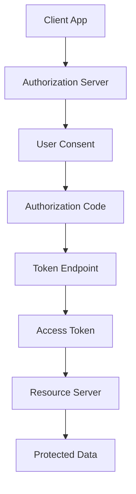

# What is OAuth 2.0?

[OAuth 2.0](https://tools.ietf.org/html/rfc6749), which stands for “Open Authorization”, is a standard designed to allow a website or application to access resources hosted by other web apps on behalf of a user. It replaced OAuth 1.0 in 2012 and is now the de facto industry standard for online authorization. OAuth 2.0 provides consented access and restricts actions of what the client app can perform on resources on behalf of the user, without ever sharing the user's credentials.

Although the web is the main platform for OAuth 2, the specification also describes how to handle this kind of delegated access to other client types (browser-based applications, server-side web applications, native/mobile apps, connected devices, etc.)

## Principles of OAuth2.0

OAuth 2.0 is an authorization protocol and NOT an authentication protocol. As such, it is designed primarily as a means of granting access to a set of resources, for example, remote APIs or user data.

OAuth 2.0 uses Access Tokens. An **Access Token** is a piece of data that represents the authorization to access resources on behalf of the end-user. OAuth 2.0 doesn’t define a specific format for Access Tokens. However, in some contexts, the JSON Web Token (JWT) format is often used. This enables token issuers to include data in the token itself. Also, for security reasons, Access Tokens may have an expiration date.

## OAuth2.0 Roles

The idea of roles is part of the core specification of the OAuth2.0 authorization framework. These define the essential components of an OAuth 2.0 system, and are as follows:

- **Resource Owner:** The user or system that owns the protected resources and can grant access to them.
- **Client:** The client is the system that requires access to the protected resources. To access resources, the Client must hold the appropriate Access Token.
- **Authorization Server:** This server receives requests from the Client for Access Tokens and issues them upon successful authentication and consent by the Resource Owner. The authorization server exposes two endpoints: the Authorization endpoint, which handles the interactive authentication and consent of the user, and the Token endpoint, which is involved in a machine to machine interaction.
- **Resource Server:** A server that protects the user’s resources and receives access requests from the Client. It accepts and validates an Access Token from the Client and returns the appropriate resources to it.

## OAuth 2.0 Scopes

Scopes are an important concept in OAuth 2.0. They are used to specify exactly the reason for which access to resources may be granted. Acceptable scope values, and which resources they relate to, are dependent on the Resource Server.

## OAuth 2.0 Access Tokens and Authorization Code

The OAuth 2 Authorization server may not directly return an Access Token after the Resource Owner has authorized access. Instead, and for better security, an **Authorization Code** may be returned, which is then exchanged for an Access Token. In addition, the Authorization server may also issue a [Refresh Token](https://auth0.com/blog/refresh-tokens-what-are-they-and-when-to-use-them/) with the Access Token. Unlike Access Tokens, Refresh Tokens normally have long expiry times and may be exchanged for new Access Tokens when the latter expires. Because Refresh Tokens have these properties, they have to be stored securely by clients.

## How Does OAuth 2.0 Work?

At the most basic level, before OAuth 2.0 can be used, the Client must acquire its own credentials, a \_client id \_ and _client secret_, from the Authorization Server in order to identify and authenticate itself when requesting an Access Token.

Using OAuth 2.0, access requests are initiated by the Client, e.g., a mobile app, website, smart TV app, desktop application, etc. The token request, exchange, and response follow this general flow:

1.  The Client requests authorization (authorization request) from the Authorization server, supplying the client id and secret to as identification; it also provides the scopes and an endpoint URI (redirect URI) to send the Access Token or the Authorization Code to.
2.  The Authorization server authenticates the Client and verifies that the requested scopes are permitted.
3.  The Resource owner interacts with the Authorization server to grant access.
4.  The Authorization server redirects back to the Client with either an Authorization Code or Access Token, depending on the grant type, as it will be explained in the next section. A Refresh Token may also be returned.
5.  With the Access Token, the Client requests access to the resource from the Resource server.

## Grant Types in OAuth 2.0

In OAuth 2.0, **grants** are the set of steps a Client has to perform to get resource access authorization. The authorization framework provides several grant types to address different scenarios:

- [Authorization Code](https://auth0.com/docs/api-auth/tutorials/authorization-code-grant) grant: The Authorization server returns a single-use Authorization Code to the Client, which is then exchanged for an Access Token. This is the best option for traditional web apps where the exchange can securely happen on the server side. The Authorization Code flow might be used by Single Page Apps (SPA) and mobile/native apps. However, here, the client secret cannot be stored securely, and so authentication, during the exchange, is limited to the use of _client id_ alone. A better alternative is the _Authorization Code with PKCE grant_, below.
- [Implicit](https://auth0.com/docs/api-auth/tutorials/implicit-grant) Grant: A simplified flow where the Access Token is returned directly to the Client. In the Implicit flow, the authorization server may return the Access Token as a parameter in the callback URI or as a response to a form post. The first option is now deprecated due to potential token leakage.
- [Authorization Code Grant with Proof Key for Code Exchange (PKCE)](https://auth0.com/docs/flows/concepts/auth-code-pkce): This authorization flow is similar to the _Authorization Code_ grant, but with additional steps that make it more secure for mobile/native apps and SPAs.
- [Resource Owner Credentials Grant Type](https://auth0.com/docs/api-auth/tutorials/password-grant): This grant requires the Client first to acquire the resource owner’s credentials, which are passed to the Authorization server. It is, therefore, limited to Clients that are completely trusted. It has the advantage that no redirect to the Authorization server is involved, so it is applicable in the use cases where a redirect is infeasible.
- [Client Credentials Grant Type](https://auth0.com/docs/api-auth/tutorials/client-credentials): Used for non-interactive applications e.g., automated processes, microservices, etc. In this case, the application is authenticated per se by using its client id and secret.
- [Device Authorization Flow](https://auth0.com/docs/flows/concepts/device-auth): A grant that enables use by apps on input-constrained devices, such as smart TVs.
- [Refresh Token Grant](https://auth0.com/blog/refresh-tokens-what-are-they-and-when-to-use-them/): The flow that involves the exchange of a Refresh Token for a new Access Token.

## Real Example Scenario

You have:

- A **Node.js App / Postman / Java App**
- It wants to access **Salesforce Accounts data**

To do this securely → you create a **Connected App in Salesforce**

---

## High-Level Flow



---

## Step-by-Step OAuth 2.0 Flow with What You Get

### Step 1 — Create Connected App in Salesforce

You configure:

- Callback URL
- OAuth Scopes (`api`, `refresh_token`)

### What You Get

- **Client ID (Consumer Key)**
- **Client Secret (Consumer Secret)**

These identify your application.

---

### Step 2 — Authorization Request

You send user to this URL:

```bash
https://login.salesforce.com/services/oauth2/authorize
?response_type=code
&client_id=CLIENT_ID
&redirect_uri=CALLBACK_URL
```

### What Happens

- User logs into Salesforce
- User gives permission

---

### Step 3 — Authorization Code Returned

Salesforce redirects:

```bash
https://yourapp.com/callback?code=AUTH_CODE
```

### What You Get

- **Authorization Code**

This is temporary and short-lived.

---

### Step 4 — Exchange Code for Token

POST request:

```bash
https://login.salesforce.com/services/oauth2/token
```

Body:

```bash
grant_type=authorization_code
client_id=CLIENT_ID
client_secret=CLIENT_SECRET
redirect_uri=CALLBACK_URL
code=AUTH_CODE
```

---

### What You Get After This Step

```json
{
  "access_token": "00Dxx0000001gPFEAY...",
  "refresh_token": "5Aep861...",
  "instance_url": "https://yourInstance.salesforce.com",
  "id": "https://login.salesforce.com/id/...",
  "issued_at": "timestamp",
  "signature": "signature"
}
```

---

## Complete OAuth Flow Diagram



---

## What is Access Token

An **Access Token** is:

- A temporary key to access Salesforce APIs
- Sent in header:

```plaintext
Authorization: Bearer ACCESS_TOKEN
```

### Important Points

- Short-lived (minutes/hours)
- Must be protected
- Used for every API call

As per OAuth concept, it represents **authorized access without exposing credentials**

---

## What is Refresh Token

A **Refresh Token** is:

- Used to generate a new access token
- Long-lived

### Why Needed

Access tokens expire → instead of logging in again:

```bash
POST /services/oauth2/token
grant_type=refresh_token
refresh_token=YOUR_REFRESH_TOKEN
```

---

## Token Lifecycle Diagram



---

## How to Prepare Request After Getting Client ID & Secret

Now comes the **practical integration part**

---

### Step 1 — Token Request (Backend)

```bash
POST https://login.salesforce.com/services/oauth2/token
```

Body:

```bash
grant_type=authorization_code
client_id=CLIENT_ID
client_secret=CLIENT_SECRET
redirect_uri=CALLBACK_URL
code=AUTH_CODE
```

---

### Step 2 — API Call Using Access Token

```bash
GET https://yourInstance.salesforce.com/services/data/v60.0/sobjects/Account
Authorization: Bearer ACCESS_TOKEN
```

---

### Apex Example (Calling Salesforce API)

```java
HttpRequest req = new HttpRequest();
req.setEndpoint('https://yourInstance.salesforce.com/services/data/v60.0/sobjects/Account');
req.setMethod('GET');
req.setHeader('Authorization', 'Bearer ' + accessToken);

Http http = new Http();
HttpResponse res = http.send(req);
System.debug(res.getBody());
```

---

## Important Concept from OAuth

OAuth 2.0 is:

- **Authorization protocol (not authentication)**
- It gives **limited access using scopes**
- No password sharing required

---

## What You Do vs What Actually Happens

### What You Do

- Create Connected App
- Get Client ID & Secret
- Request Authorization
- Exchange code for token
- Call APIs

---

### What Actually Happens Internally



---
