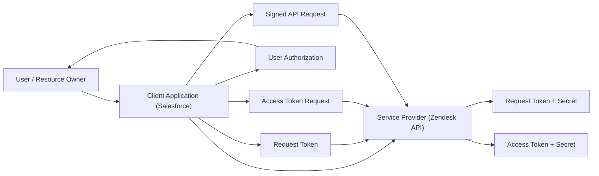

# OAuth 1.0 (Deprecated)

## What is OAuth 1.0

OAuth 1.0 is an **authorization protocol** that allows a third-party application to access a user’s resources **without sharing the user’s credentials (username/password)**.

Instead of credentials, it uses:

- **Tokens**
- **Cryptographic signatures (HMAC-SHA1)**

👉 Key idea:

> “Never send passwords. Always send signed requests.”

---

## Core Components (Architecture Building Blocks)

| Component            | Description                              |
| -------------------- | ---------------------------------------- |
| Resource Owner       | The user (Zendesk user, Salesforce user) |
| Consumer (Client)    | Your application (Salesforce)            |
| Service Provider     | API provider (Zendesk, Twitter, etc.)    |
| Consumer Key         | Public identifier of your app            |
| Consumer Secret      | Private key used for signing             |
| Token & Token Secret | Temporary credentials                    |

---

## OAuth 1.0 Architecture



---

## How OAuth 1.0 Works (Step-by-Step Flow)

### Step 1: Request Token

- Client sends a signed request to get a **Request Token**
- Includes:
  - Consumer Key
  - Timestamp
  - Nonce
  - Signature

👉 Output:

- Request Token
- Request Token Secret

---

### Step 2: User Authorization

- User is redirected to Service Provider (Zendesk/Twitter)
- User grants permission

👉 Output:

- Authorized Request Token

---

### Step 3: Exchange for Access Token

- Client sends:
  - Request Token
  - Signature

👉 Output:

- Access Token
- Access Token Secret

---

### Step 4: Access Protected Resource

- Every API request must include:
  - Token
  - Signature (HMAC-SHA1)
  - Timestamp
  - Nonce

👉 Example:

```http
Authorization: OAuth
    oauth_consumer_key="abc",
    oauth_token="xyz",
    oauth_signature="generated_signature",
    oauth_timestamp="123456789",
    oauth_nonce="random_string"
```

---

## Internal Working (Important for Interviews)

### Signature Generation

OAuth 1.0 does **NOT trust HTTPS alone**
It ensures security using:

- Base string creation
- Signing with:
  - Consumer Secret
  - Token Secret

```text
Signature = HMAC-SHA1(BaseString, ConsumerSecret&TokenSecret)
```

---

### Why Nonce + Timestamp?

- Prevent **Replay Attacks**
- Each request must be unique

---

## Real Problem You Will Face (Salesforce Context)

👉 Implementing OAuth 1.0 in Apex is painful because:

- You must manually:
  - Generate signature
  - Handle encoding
  - Manage nonce & timestamp

- No native simple support like OAuth 2.0 Named Credentials

---

# Cons of OAuth 1.0 (Why OAuth 2.0 Exists)

This is the most important part for interviews.

---

## Complexity is Very High

- Signature generation is complex
- Many parameters required
- Easy to make mistakes

👉 Developer pain:

> Debugging signature mismatch is a nightmare

---

## Tight Coupling with Cryptography

- Requires HMAC-SHA1 signing
- Hard to implement in many platforms

---

## No Flexibility

- Fixed flow
- No support for:
  - Mobile apps
  - SPA (Single Page Apps)
  - Modern architectures

---

## Poor Developer Experience

- Requires:
  - Nonce
  - Timestamp
  - Signature base string

👉 Compare with OAuth 2.0:

- Just use Bearer Token

---

## Performance Overhead

- Every request requires signature generation
- Slower than OAuth 2.0

---

## Hard to Scale

- Not suitable for:
  - Microservices
  - Distributed systems
  - High-frequency APIs

---

## Limited Adoption Today

- Mostly deprecated
- Rarely used except legacy systems (e.g., old Twitter APIs)

---

# Why OAuth 2.0 Replaced OAuth 1.0

| OAuth 1.0                      | OAuth 2.0                                            |
| ------------------------------ | ---------------------------------------------------- |
| Signature-based                | Token-based (Bearer)                                 |
| Complex                        | Simple                                               |
| Cryptographic signing required | HTTPS is enough                                      |
| Hard to implement              | Easy with libraries                                  |
| No flexibility                 | Multiple flows (Auth Code, Client Credentials, etc.) |

---

# Simple Mental Model

👉 OAuth 1.0:

> “Sign every request like a bank cheque”

👉 OAuth 2.0:

> “Show your access card (token)”

---
