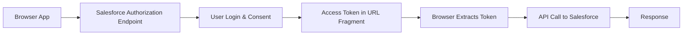
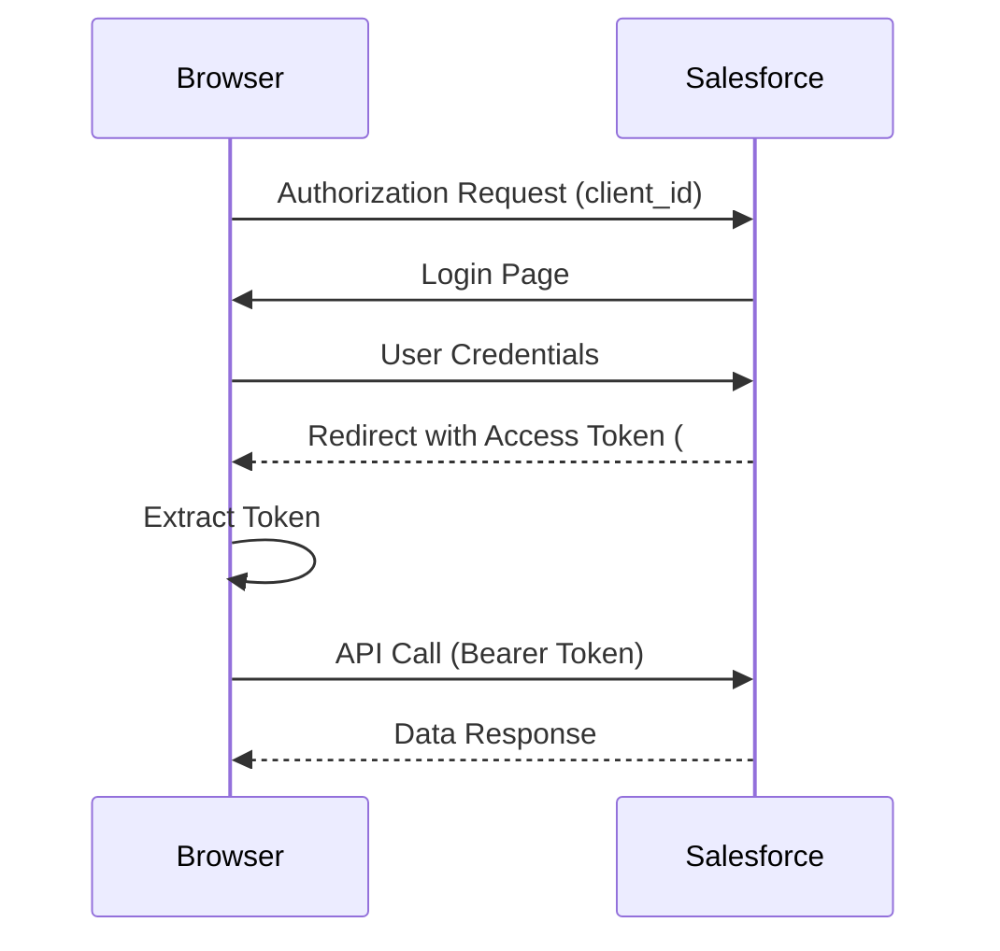

# OAuth 2.0 USER AGENT FLOW (Implicit Flow)

When to go with agent flow?

if your application is an SSO & can't handle the client id & client secret then go for agent flow. if your application is able to store
and handle the client id and secret then go web server flow.

## Salesforce OAuth 2.0 User-Agent Flow (Implicit Flow)

User-Agent Flow (also called **Implicit Flow**) is a lightweight OAuth 2.0 flow where the **access token is returned directly in the browser** instead of exchanging an authorization code.

It is designed for **client-side apps** that cannot securely store a client secret.

---

## When to Go for User-Agent Flow

Use this flow when:

- Your app is a **Single Page Application (SPA)** (React, Angular, LWC outside Salesforce)
- Your app runs entirely in the **browser**
- You **cannot securely store client secret**
- You need **quick authentication without backend exchange**

Avoid this flow when:

- You have a backend server → use Authorization Code Flow
- You need high security → use PKCE or JWT
- You require refresh tokens (Implicit flow usually doesn’t provide them)

---

## Real Example Scenario

You built:

- A portfolio site (like your GitHub Pages project)
- You want to login with Salesforce and fetch user data

You cannot store client secret → so you use **User-Agent Flow**

---

## How User-Agent Flow Works



---

## Step-by-Step Flow with What You Get

### Step 1 — Create Connected App

Configure:

- Callback URL
- OAuth scopes (`api`, `id`, etc.)

### What You Get

- **Client ID (Consumer Key)**
  (No client secret needed here)

---

### Step 2 — Authorization Request

Open this in browser:

```plaintext
https://login.salesforce.com/services/oauth2/authorize
?response_type=token
&client_id=CLIENT_ID
&redirect_uri=CALLBACK_URL
```

---

### Step 3 — User Login & Consent

User logs in and allows access.

---

### Step 4 — Salesforce Redirects with Token

```plaintext
https://yourapp.com/callback#access_token=00Dxx...&instance_url=https://xxx.salesforce.com
```

### What You Get

- **Access Token**
- **Instance URL**
- Token expiry info

Important: Token is in **URL fragment (`#`)**, not query param

---

## Complete Flow Diagram



---

## What is Happening Internally

- No authorization code step
- No client secret usage
- Token is issued directly

This makes it **fast but less secure**

---

## How to Use Access Token

Example API call:

```http
GET https://yourInstance.salesforce.com/services/data/v60.0/sobjects/Account
Authorization: Bearer ACCESS_TOKEN
```

---

## JavaScript Example (Frontend)

```javascript
const hash = window.location.hash;

const params = new URLSearchParams(hash.replace("#", ""));

const accessToken = params.get("access_token");
const instanceUrl = params.get("instance_url");

fetch(`${instanceUrl}/services/data/v60.0/sobjects/Account`, {
  headers: {
    Authorization: `Bearer ${accessToken}`,
  },
})
  .then((res) => res.json())
  .then((data) => console.log(data));
```

---

## Security Concerns (Very Important)

User-Agent Flow has risks:

- Token exposed in URL
- Can be stored in browser history
- Vulnerable to XSS attacks
- No refresh token support

Because of these issues, modern best practice:

👉 Use **Authorization Code + PKCE instead**

---

## Comparison with Authorization Code Flow

| Feature          | User-Agent Flow | Auth Code Flow |
| ---------------- | --------------- | -------------- |
| Client Secret    | ❌ Not used     | ✅ Used        |
| Security         | Low             | High           |
| Refresh Token    | ❌ No           | ✅ Yes         |
| Backend Required | ❌ No           | ✅ Yes         |
| Use Case         | SPA             | Server Apps    |

---

## When You Should Actually Use It (Real Advice)

Use User-Agent Flow only if:

- You are building a **pure frontend demo project**
- You are testing OAuth quickly
- You have **no backend at all**

Otherwise:

👉 Prefer **PKCE Flow (modern standard for SPAs)**

---

## Mental Model

Think like this:

- User-Agent Flow = “Give me token directly in browser”
- Auth Code Flow = “Give me code, I’ll securely exchange it”

---

## Key Takeaways

- Designed for browser-only apps
- No client secret involved
- Token comes directly in URL
- Fast but less secure
- Being replaced by PKCE in modern systems
