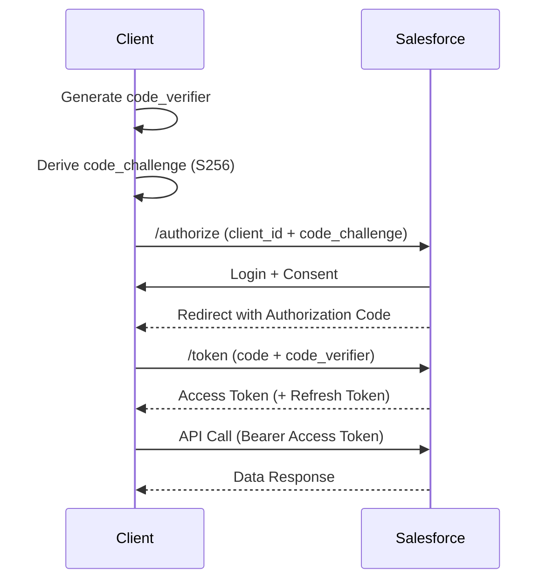
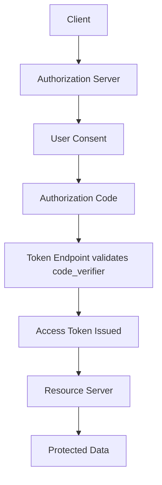

# OAuth 2.0 Authorization Code Flow with PKCE - (Proof Key Exchange)

adding one layer to security for web server flow.

SALESFORCE --> LINKEDIN (SUPPORT PKCE) --> Then we are able to do the configs.

## OAuth 2.0 Authorization Code Flow

PKCE is an extension of the Authorization Code Flow designed for **public clients** (browser apps, mobile apps) that **cannot securely store a client secret**. It prevents **authorization code interception attacks** by binding the authorization request to the token exchange.

---

## When to Use PKCE

- Single Page Applications (React, Angular, standalone LWC)
- Mobile apps (Android, iOS)
- Desktop apps
- Any app where storing a client secret is unsafe

Avoid plain Authorization Code Flow for these cases; use PKCE instead.

---

## Core Idea

Instead of a client secret, the app creates a **one-time secret pair**:

- `code_verifier` (random, high-entropy string; kept on client)
- `code_challenge` (derived from verifier; sent to authorization server)

Salesforce later requires the original `code_verifier` to exchange the code for tokens. If an attacker steals the authorization code, they **cannot** exchange it without the verifier.

---

## High-Level Flow

```mermaid
flowchart LR
    A[Client App] --> B[Generate code_verifier]
    B --> C[Create code_challenge (SHA256)]
    C --> D[Authorization Request with challenge]
    D --> E[User Login & Consent]
    E --> F[Authorization Code]
    F --> G[Token Request with code_verifier]
    G --> H[Access Token (+ Refresh Token)]
    H --> I[API Call to Salesforce]
```

---

## Step-by-Step with What You Get

### Step 1 — Create Connected App in Salesforce

Configure:

- Callback URL
- OAuth scopes: `api`, `refresh_token`, `openid` (as needed)

What you get:

- **Client ID (Consumer Key)**
- Client secret is **not required** for PKCE public clients

---

### Step 2 — Generate PKCE Values (Client Side)

Create a high-entropy `code_verifier` (43–128 chars), then derive `code_challenge`:

- Method: `S256` (recommended)

```javascript
// Generate code_verifier
const codeVerifier = base64UrlEncode(
  crypto.getRandomValues(new Uint8Array(32)),
);

// Derive code_challenge = BASE64URL(SHA256(code_verifier))
async function sha256(buffer) {
  return await crypto.subtle.digest("SHA-256", buffer);
}

function base64UrlEncode(arrayBuffer) {
  let bytes = new Uint8Array(arrayBuffer);
  let str = btoa(String.fromCharCode(...bytes));
  return str.replace(/\+/g, "-").replace(/\//g, "_").replace(/=+$/, "");
}

async function generateChallenge(verifier) {
  const data = new TextEncoder().encode(verifier);
  const digest = await sha256(data);
  return base64UrlEncode(digest);
}
```

What you get:

- `code_verifier` (kept locally)
- `code_challenge` (sent to Salesforce)

---

### Step 3 — Authorization Request

Redirect the user to Salesforce:

```plaintext
https://login.salesforce.com/services/oauth2/authorize
?response_type=code
&client_id=CLIENT_ID
&redirect_uri=CALLBACK_URL
&code_challenge=CODE_CHALLENGE
&code_challenge_method=S256
```

What happens:

- User logs in and consents

---

### Step 4 — Authorization Code Returned

Salesforce redirects:

```plaintext
https://yourapp.com/callback?code=AUTH_CODE
```

What you get:

- **Authorization Code** (short-lived)

---

### Step 5 — Exchange Code for Tokens (PKCE)

POST to token endpoint:

```plaintext
https://login.salesforce.com/services/oauth2/token
```

Body:

```plaintext
grant_type=authorization_code
client_id=CLIENT_ID
redirect_uri=CALLBACK_URL
code=AUTH_CODE
code_verifier=CODE_VERIFIER
```

What you get:

```json
{
  "access_token": "00Dxx...",
  "refresh_token": "5Aep...",
  "instance_url": "https://yourInstance.salesforce.com",
  "id": "https://login.salesforce.com/id/...",
  "issued_at": "timestamp",
  "signature": "signature"
}
```

- **Access Token**
- **Refresh Token** (if scope allowed)
- **Instance URL**

---

## Sequence Diagram



---

## Using the Access Token

```http
GET https://yourInstance.salesforce.com/services/data/v60.0/sobjects/Account
Authorization: Bearer ACCESS_TOKEN
```

---

## Refresh Token Flow

When the access token expires:

```http
POST https://login.salesforce.com/services/oauth2/token
```

Body:

```plaintext
grant_type=refresh_token
client_id=CLIENT_ID
refresh_token=REFRESH_TOKEN
```

Returns a new **access token**.

---

## Why PKCE is Secure

- Authorization code alone is **useless** without `code_verifier`
- Verifier is **never sent** during authorization request
- Protects against:
  - Code interception
  - Malicious apps trying to redeem the code

---

## Comparison

| Aspect                               | Authorization Code | Authorization Code + PKCE |
| ------------------------------------ | ------------------ | ------------------------- |
| Client Secret                        | Required           | Not required              |
| Security (public clients)            | Weak               | Strong                    |
| Recommended for SPA/Mobile           | No                 | Yes                       |
| Protection against code interception | No                 | Yes                       |

---

## Salesforce-Specific Notes

- Works with **Connected Apps**
- Use **S256** method (not `plain`)
- Enable scopes like `refresh_token` if you need long sessions
- Combine with **Named Credentials** (in server-side cases) for cleaner callouts
- Respect Salesforce API limits and token policies

---

## What You Do vs How It Works

What you do:

- Create Connected App
- Generate verifier/challenge
- Redirect user
- Exchange code using verifier
- Call APIs with access token

How it works internally:



---

## Key Takeaways

- PKCE = secure OAuth for public clients
- Replaces client secret with dynamic verifier
- Prevents authorization code interception
- Recommended standard for modern apps (SPA, mobile)
- Fully supported with Salesforce Connected Apps
