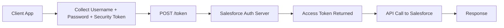
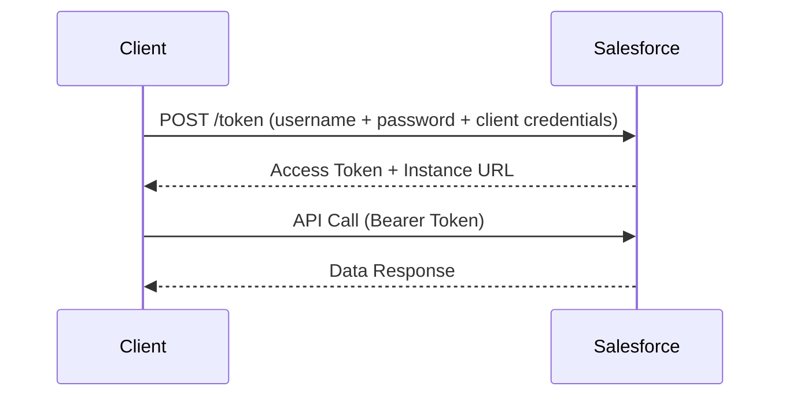
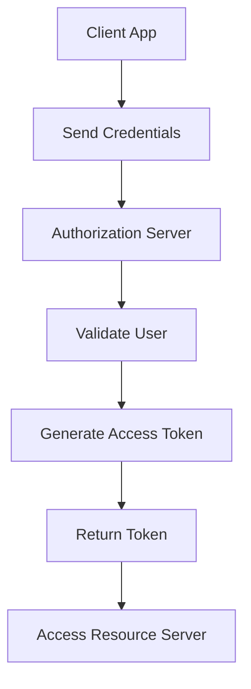

# OAuth 2.0 with Username & Password - Not recommended

This flow (also called **Resource Owner Password Credentials Grant**) lets a client exchange a **username + password** directly for an access token. In Salesforce, you also append the **security token** to the password.

This is the **most direct** OAuth flow—no browser redirect, no authorization code.

---

## When to Use (and When Not To)

Use it only when:

- You control both client and user (fully trusted system)
- Non-interactive integrations (scripts, backend jobs)
- Legacy systems where redirect flows aren’t possible

Avoid it when:

- Building public apps or SPAs
- You can use Authorization Code + PKCE or JWT
- Security is a concern (because credentials are handled directly)

---

## High-Level Flow



---

## What You Need Before Starting

- Connected App (OAuth enabled)
- Client ID (Consumer Key)
- Client Secret (Consumer Secret)
- Salesforce Username
- Password + Security Token (concatenated)

Example:

```plaintext id="p2k6g8"
password = MyPass123 + SECURITY_TOKEN
```

---

## Step-by-Step Flow with What You Get

### Step 1 — Create Connected App

Configure:

- Enable OAuth
- Add scopes: `api`, `refresh_token` (optional but often not used here)

What you get:

- **Client ID**
- **Client Secret**

---

### Step 2 — Token Request

Make a POST request:

```http id="3t8v0y"
POST https://login.salesforce.com/services/oauth2/token
Content-Type: application/x-www-form-urlencoded
```

Body:

```plaintext id="9x3jv2"
grant_type=password
client_id=CLIENT_ID
client_secret=CLIENT_SECRET
username=USERNAME
password=PASSWORD+SECURITY_TOKEN
```

---

### Step 3 — Response from Salesforce

```json id="w1g4m6"
{
  "access_token": "00Dxx0000001gPFEAY...",
  "instance_url": "https://yourInstance.salesforce.com",
  "id": "https://login.salesforce.com/id/...",
  "token_type": "Bearer",
  "issued_at": "timestamp",
  "signature": "signature"
}
```

What you get:

- **Access Token**
- **Instance URL**
- No refresh token in most cases

---

## Sequence Diagram



---

## Using the Access Token

```http id="8c5m1z"
GET https://yourInstance.salesforce.com/services/data/v60.0/sobjects/Account
Authorization: Bearer ACCESS_TOKEN
```

---

## Apex Example (External Call Simulation)

If you simulate this from Apex (rare but possible via external auth):

```apex id="h7l2q4"
HttpRequest req = new HttpRequest();
req.setEndpoint('https://login.salesforce.com/services/oauth2/token');
req.setMethod('POST');

String body = 'grant_type=password'
    + '&client_id=CLIENT_ID'
    + '&client_secret=CLIENT_SECRET'
    + '&username=USERNAME'
    + '&password=PASSWORD_SECURITYTOKEN';

req.setHeader('Content-Type', 'application/x-www-form-urlencoded');
req.setBody(body);

Http http = new Http();
HttpResponse res = http.send(req);
System.debug(res.getBody());
```

---

## What is Happening Internally



---

## Security Risks (Important)

This flow is considered **least secure** among OAuth flows.

Why:

- You are handling **actual user credentials**
- No user consent screen
- Credentials may be logged or exposed
- No separation between authentication and authorization

---

## Limitations

- No refresh token (usually)
- Not suitable for public apps
- Violates OAuth best practice (sharing credentials)
- Cannot enforce granular consent easily
- Risk of account compromise

---

## When Salesforce Developers Still Use It

- Quick testing (Postman, scripts)
- Internal backend automation
- Legacy integrations

But in real enterprise systems:

- JWT Flow or PKCE is preferred

---

## Comparison with Other Flows

| Flow               | Security  | Use Case                 |
| ------------------ | --------- | ------------------------ |
| Username–Password  | Low       | Internal trusted systems |
| Authorization Code | High      | Web apps                 |
| PKCE               | Very High | SPA / Mobile             |
| JWT Bearer         | Very High | Server-to-server         |

---

## What You Do vs What Actually Happens

What you do:

- Send username + password + client credentials
- Receive access token
- Call APIs

What happens internally:

- Salesforce validates credentials
- Generates token
- Grants API access

---

## Key Takeaways

- Simplest OAuth flow but least secure
- Direct credential exchange → risky
- No redirects or browser interaction
- Good for testing, not for production apps
- Prefer JWT or PKCE for real-world systems

---
