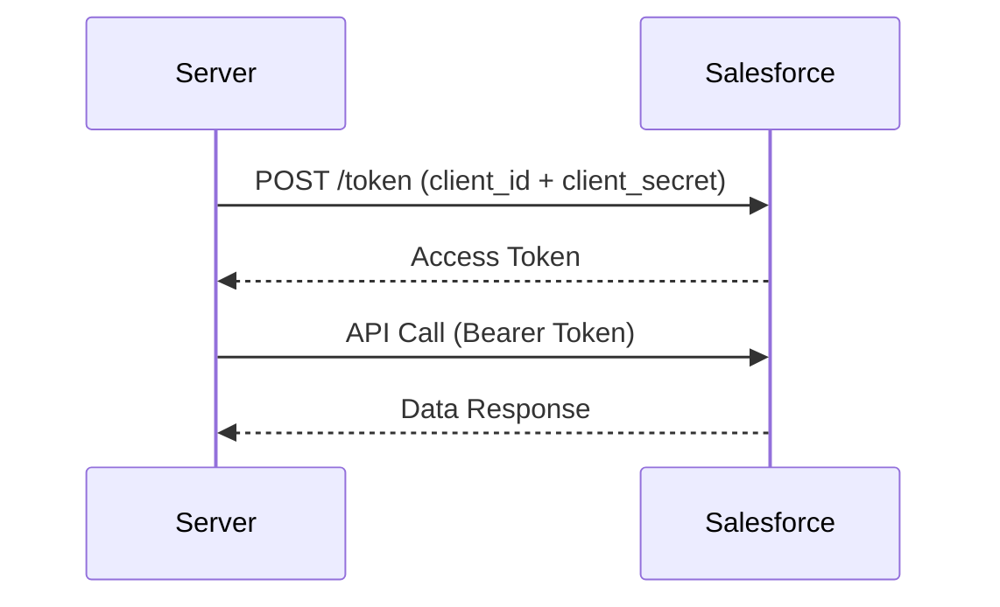
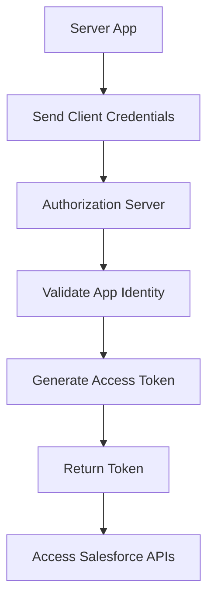

# OAuth 2.0 with Client Credencial Flow for Server to Server

This flow is for **machine-to-machine (M2M)** communication where **no user is involved**. One server (your app) authenticates itself with Salesforce and gets an access token to call APIs.

---

## When to Use

Use Client Credentials flow when:

- Backend service → Salesforce (no UI, no user login)
- Scheduled jobs, middleware, microservices
- You want a **dedicated integration user context**
- Fully controlled, trusted environment

Avoid it when:

- You need user-specific data or consent
- You’re building SPAs/mobile apps (use PKCE)

---

## High-Level Flow

```mermaid id="m9w2pr"
flowchart LR
    A[Server App] --> B[POST /token (client_id + client_secret)]
    B --> C[Salesforce Authorization Server]
    C --> D[Access Token Issued]
    D --> E[API Call to Salesforce]
    E --> F[Data Response]
```

---

## Salesforce Setup (Connected App)

Configure a **Connected App** with:

- Enable OAuth
- Scopes: `api` (and others if needed)
- **Client Credentials Flow enabled**
- **Run As User** (integration user)

What you get:

- **Client ID (Consumer Key)**
- **Client Secret (Consumer Secret)**

---

## Step-by-Step Flow with What You Get

### Step 1 — Token Request (No User)

```http id="q3k1bv"
POST https://login.salesforce.com/services/oauth2/token
Content-Type: application/x-www-form-urlencoded
```

Body:

```plaintext id="d4y8n1"
grant_type=client_credentials
client_id=CLIENT_ID
client_secret=CLIENT_SECRET
```

---

### Step 2 — Response

```json id="p6r7tx"
{
  "access_token": "00Dxx0000001gPFEAY...",
  "instance_url": "https://yourInstance.salesforce.com",
  "token_type": "Bearer",
  "issued_at": "timestamp"
}
```

What you get:

- **Access Token**
- **Instance URL**

No refresh token in this flow.

---

## Sequence Diagram



---

## Using the Access Token

```http id="v5n8c2"
GET https://yourInstance.salesforce.com/services/data/v60.0/sobjects/Account
Authorization: Bearer ACCESS_TOKEN
```

---

## Apex Perspective (Calling External System Using This Flow)

In Salesforce, you typically **consume** external APIs, but if Salesforce needs to act as a client:

```apex id="a2k7mz"
HttpRequest req = new HttpRequest();
req.setEndpoint('https://login.salesforce.com/services/oauth2/token');
req.setMethod('POST');

String body = 'grant_type=client_credentials'
    + '&client_id=CLIENT_ID'
    + '&client_secret=CLIENT_SECRET';

req.setHeader('Content-Type', 'application/x-www-form-urlencoded');
req.setBody(body);

Http http = new Http();
HttpResponse res = http.send(req);
System.debug(res.getBody());
```

---

## What is Happening Internally



---

## Key Concept: Run As User

Even though no user logs in, Salesforce executes API calls as a **specific user**:

- Defined in Connected App
- Controls permissions, object access, field access

This is critical for **data security and auditing**

---

## Security Model

- Uses **client_id + client_secret**
- No user credentials involved
- Token represents **application identity**
- Permissions controlled via **Run As User**

---

## Limitations

- No refresh token → request new token when expired
- No user context (cannot act on behalf of different users)
- Requires secure storage of client secret
- Limited flexibility compared to JWT for complex setups

---

## Comparison with Other Flows

| Flow               | User Involved     | Use Case                |
| ------------------ | ----------------- | ----------------------- |
| Client Credentials | No                | Server-to-server        |
| Username–Password  | Yes (credentials) | Legacy/internal         |
| Authorization Code | Yes               | Web apps                |
| PKCE               | Yes               | SPA/mobile              |
| JWT Bearer         | No                | Enterprise integrations |

---

## Real-World Example

Imagine:

- A **Node.js microservice**
- Runs every hour
- Syncs data from Salesforce

Flow:

1. Microservice requests token using client credentials
2. Gets access token
3. Calls Salesforce API (Accounts, Cases)
4. Processes data

No login, no UI, fully automated.

---

## What You Do vs What Actually Happens

What you do:

- Configure Connected App
- Send client_id + client_secret
- Get access token
- Call APIs

What happens:

- Salesforce validates app identity
- Assigns Run As User
- Issues token
- Allows API access

---

## Key Takeaways

- Best for **server-to-server integrations**
- No user interaction required
- Simple and fast flow
- Requires secure handling of client secret
- Uses integration user for permissions

---
