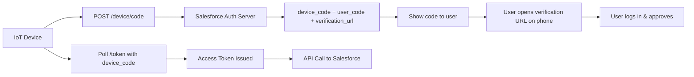
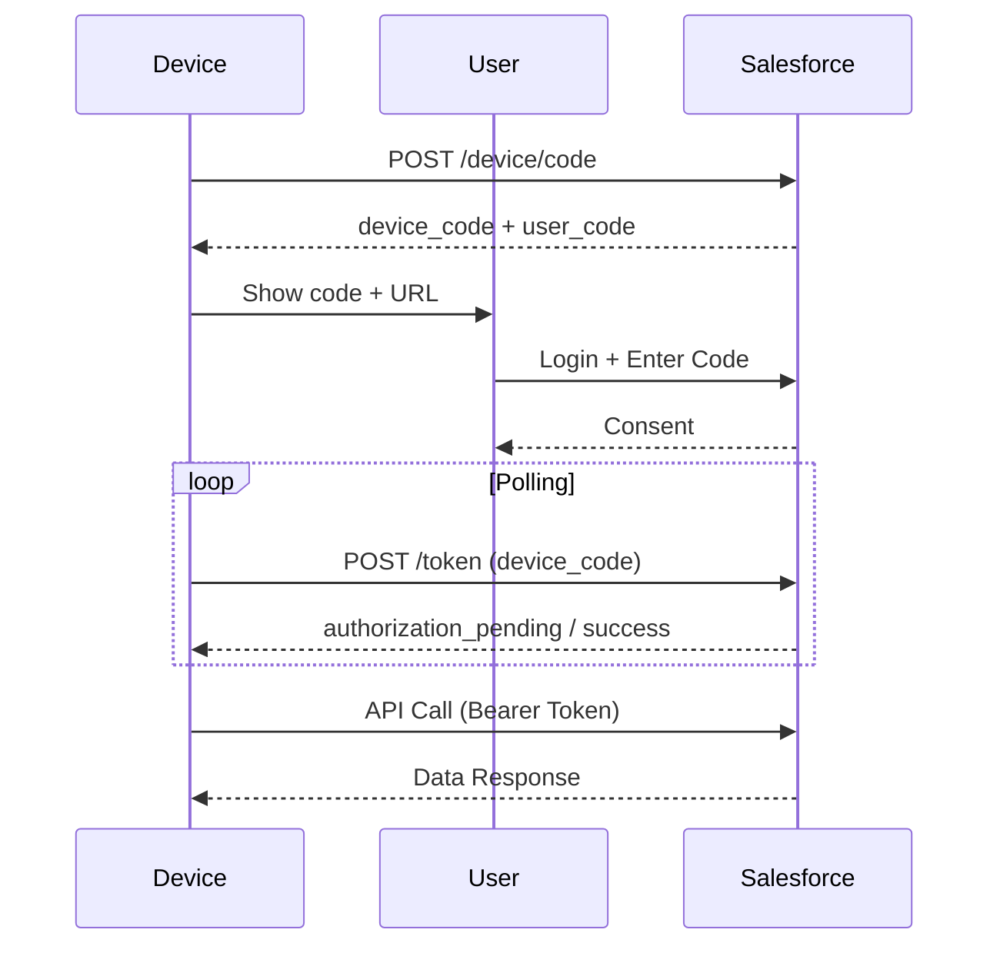
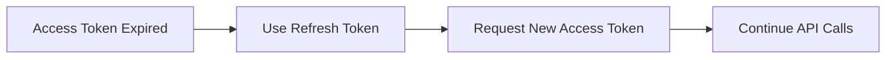

# OAuth 2.0 Device Flow for IOT Integration

The **Device Flow** is designed for devices that **cannot open a browser or accept full user input** (smart TVs, IoT devices, CLI tools). The device gets a **user code** and asks the user to authorize on a **separate device** (phone/laptop). Meanwhile, the device **polls** Salesforce until authorization is completed.

---

## When to Use

- IoT devices (sensors, smart displays, TVs)
- Command-line tools
- Devices with limited input (no keyboard/browser)
- Kiosk-style or headless systems

Avoid when you can use:

- Authorization Code + PKCE (SPAs/mobile)
- JWT / Client Credentials (server-to-server without user)

---

## High-Level Flow



---

## What You Need (Connected App)

Configure a **Connected App**:

- Enable OAuth
- Scopes: `api`, `refresh_token` (if you want long sessions)
- Enable **Device Flow** (Device Authorization Grant)
- Set appropriate policies (IP relaxation, permitted users)

What you get:

- **Client ID (Consumer Key)**
- Client secret may not be required for public device clients

---

## Step-by-Step with What You Get

### Step 1 — Request Device & User Codes

Device sends:

```http id="t0n7k1"
POST https://login.salesforce.com/services/oauth2/device/code
Content-Type: application/x-www-form-urlencoded
```

Body:

```plaintext id="8jv3s4"
client_id=CLIENT_ID
scope=api refresh_token
```

---

### Response

```json id="2m5w6a"
{
  "device_code": "GmRhmhcxhwAzkoEqiMEg_DnyEysNkuNhszIySk9eS",
  "user_code": "WDJB-MJHT",
  "verification_uri": "https://login.salesforce.com/device",
  "verification_uri_complete": "https://login.salesforce.com/device?user_code=WDJB-MJHT",
  "expires_in": 900,
  "interval": 5
}
```

What you get:

- **device_code** → used by device to poll
- **user_code** → user enters on another device
- **verification URL** → where user logs in
- **interval** → polling frequency

---

## Step 2 — Show Instructions to User

Device displays:

```plaintext id="y4c9x2"
Go to: https://login.salesforce.com/device
Enter Code: WDJB-MJHT
```

---

## Step 3 — User Authorization (Separate Device)

- User opens URL on phone/laptop
- Logs into Salesforce
- Enters user code
- Grants permission

---

## Step 4 — Device Polls for Token

Device repeatedly calls:

```http id="1k8p0v"
POST https://login.salesforce.com/services/oauth2/token
```

Body:

```plaintext id="6n2q7b"
grant_type=urn:ietf:params:oauth:grant-type:device_code
client_id=CLIENT_ID
device_code=DEVICE_CODE
```

---

### Possible Responses While Polling

- `authorization_pending` → user hasn’t approved yet
- `slow_down` → reduce polling frequency
- `access_denied` → user denied
- success → token returned

---

### Success Response

```json id="5p3l9d"
{
  "access_token": "00Dxx...",
  "refresh_token": "5Aep...",
  "instance_url": "https://yourInstance.salesforce.com",
  "token_type": "Bearer"
}
```

What you get:

- **Access Token**
- **Refresh Token** (if scope allowed)
- **Instance URL**

---

## Sequence Diagram



---

## Using the Access Token

```http id="z3h8x1"
GET https://yourInstance.salesforce.com/services/data/v60.0/sobjects/Account
Authorization: Bearer ACCESS_TOKEN
```

---

## Token Lifecycle



---

## Security Characteristics

- No credentials entered on device
- User authenticates on trusted browser
- Short-lived device codes
- Polling controlled by interval

---

## Limitations

- Requires polling (inefficient vs direct flows)
- Slight delay (depends on user action)
- Needs user involvement (not fully automated)
- Not ideal for high-frequency systems

---

## Real-World Example

A smart factory device:

- Displays: “Connect to Salesforce”
- Shows code: `ABCD-1234`
- Operator logs in on phone
- Device starts syncing data to Salesforce

---

## What You Do vs What Happens

What you do:

- Request device code
- Show user code
- Poll for token
- Call APIs

What happens:

- Salesforce waits for user approval
- Links device to user session
- Issues token securely

---

## Key Takeaways

- Designed for devices without browsers/input
- Uses **user_code + device_code** mechanism
- Secure because login happens on trusted device
- Supports refresh tokens
- Ideal for IoT and CLI integrations

---
